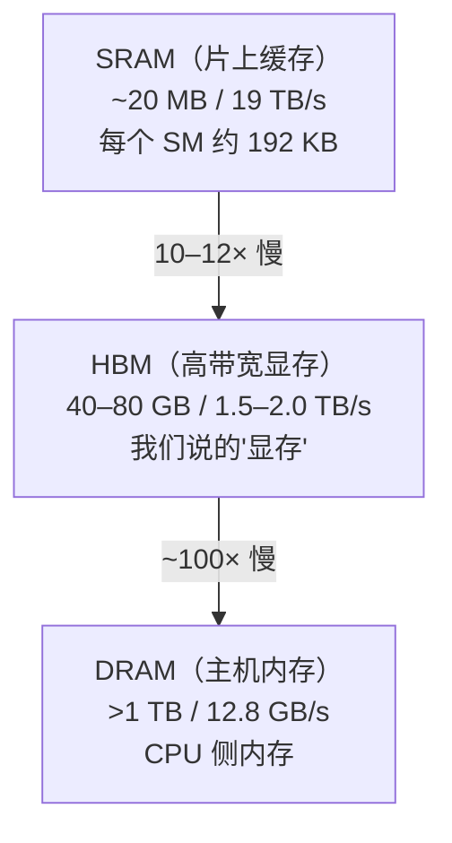

# FlashAttention

> 对应论文：`paper/FlashAttention-Fast-Memory-Efficient-Exact-Attention.pdf`（Dao et al., 2022，arXiv:2205.14135）
>
> 核心问题：标准 Attention 的瓶颈不是计算量（FLOPs），而是内存带宽。FlashAttention 通过分块（Tiling）和重计算（Recomputation）两项技术，将 HBM 读写量减少 9×，让完全精确的 Attention 在 A100 上实现 5.7× 加速。

---

## 1. 背景：Attention 慢，到底慢在哪里

### 1.1 先澄清一个常见误解

大多数人认为 Attention 慢是因为 $O(N^2)$ 的 FLOPs（计算量）。这是错的。

真正的原因藏在 GPU 硬件里。

现代 GPU 的计算速度（以 TFLOPS 衡量）远远领先于内存带宽（以 TB/s 衡量）。A100 的峰值算力是 312 TFLOPS（BF16），但 HBM 带宽只有 2.0 TB/s——两者差距超过 100 倍。这意味着 GPU 的计算核心大部分时间都在等数据从内存里搬过来，而不是真的在做乘加运算。

这类操作被称为 **memory-bound**（内存带宽瓶颈），与之相对的是 **compute-bound**（计算瓶颈）。区分两者的指标叫 **算术强度**（arithmetic intensity）：

$$
\text{算术强度} = \frac{\text{FLOPs}}{\text{字节数（内存读写量）}}
$$

- **Compute-bound**：算术强度高，典型例子是大矩阵乘法（每个数据读一次，参与大量乘加）
- **Memory-bound**：算术强度低，典型例子是 softmax、elementwise 操作、attention score 计算

标准 Attention 的 softmax 和 attention score 步骤都是 memory-bound——GPU 把数据从内存搬进来，做几次简单运算，再搬回去，白白浪费了绝大部分算力。

### 1.2 GPU 的内存层级

A100 GPU 有三级内存，速度和容量呈反比：



关键数字：**SRAM 比 HBM 快约 10–12×，但容量只有 HBM 的约 1/2000**（20 MB vs 40 GB）。

CUDA 核心做计算时，操作数必须在 SRAM 里。每次从 HBM 读数据到 SRAM、再把结果写回 HBM，就是一次"HBM 访问"。这是有代价的：数据量越大，搬运时间越长，GPU 计算核心的等待时间就越长。

---

## 2. 标准 Attention 的瓶颈：三次往返 HBM

标准 Attention 实现（论文 Algorithm 0）分三步走：

**步骤一：计算注意力分数矩阵 $S$**

从 HBM 读入 $Q$（形状 $N \times d$）和 $K$（形状 $N \times d$），计算：

$$
S = \frac{QK^\top}{\sqrt{d}} \in \mathbb{R}^{N \times N}
$$

然后把 $S$ 写回 HBM。

**步骤二：计算归一化权重矩阵 $P$**

从 HBM 再读入 $S$，对每一行做 softmax：

$$
P = \text{softmax}(S) \in \mathbb{R}^{N \times N}
$$

再把 $P$ 写回 HBM。

**步骤三：计算输出 $O$**

从 HBM 读入 $P$ 和 $V$，计算：

$$
O = PV \in \mathbb{R}^{N \times d}
$$

把 $O$ 写回 HBM。

问题出在哪里？$S$ 和 $P$ 都是 $N \times N$ 的矩阵。当序列长度 $N = 16384$ 时，单个 $N \times N$ 的 float32 矩阵就需要 1 GB 显存。每一步都要把这个巨大的矩阵在 HBM 和计算核心之间反复搬运。

论文用实测数据给出了量化结论：

- 标准 Attention 的 HBM 访问量：$\Theta(Nd + N^2)$
- 对于 $N=1024, d=64$：$N^2 = 1{,}048{,}576 \gg Nd = 65{,}536$，$N^2$ 项完全主导

**实测数字（A100，GPT-2 medium，$N=1024, d=64$）**：

| 指标 | 标准 Attention | FlashAttention |
|:---|:---:|:---:|
| GFLOPs | 66.6 | 75.2（更多！）|
| HBM 读写量 | 40.3 GB | 4.4 GB（少 9×）|
| 运行时间 | 41.7 ms | **7.3 ms（快 5.7×）**|

注意这里的反常现象：FlashAttention 的 FLOPs 反而**更多**，但它却更快。原因正在下一节揭晓。

---

## 3. FlashAttention 的两大核心技术

### 3.1 技术一：Tiling（分块，不写大矩阵）

**直觉类比**：看视频时，你不需要把整部电影下载完再播放，流媒体技术会把视频切成小片段，一边下载一边播放。FlashAttention 对 Attention 做了类似的事——把 $Q$、$K$、$V$ 切成小块，逐块加载到 SRAM，在 SRAM 上做完计算再把结果写回 HBM，**中间的 $N \times N$ 矩阵从头到尾不需要出现**。

但 Tiling 有一个核心挑战：softmax 需要知道一整行的最大值才能归一化，怎么分块？

#### Online Softmax：增量更新的数值稳定 softmax

对于向量 $x \in \mathbb{R}^B$，标准的数值稳定 softmax 分三步：

$$
m(x) = \max_i x_i \quad \text{（行最大值）}
$$

$$
f(x) = \begin{bmatrix} e^{x_1 - m(x)}, \ldots, e^{x_B - m(x)} \end{bmatrix} \quad \text{（去掉最大值后的指数）}
$$

$$
\ell(x) = \sum_i f(x)_i \quad \text{（归一化分母）}
$$

最终 softmax 值为 $f(x) / \ell(x)$。

现在假设我们分两块读入，先读 $x^{(1)}$，再读 $x^{(2)}$，怎么增量更新？

读完 $x^{(1)}$ 后，记住 $m^{(1)} = m(x^{(1)})$，$\ell^{(1)} = \ell(x^{(1)})$。

读到 $x^{(2)}$ 时，合并更新：

$$
m^{(\text{new})} = \max\!\left(m^{(1)},\; m(x^{(2)})\right)
$$

$$
\ell^{(\text{new})} = e^{m^{(1)} - m^{(\text{new})}} \cdot \ell^{(1)} + e^{m(x^{(2)}) - m^{(\text{new})}} \cdot \ell(x^{(2)})
$$

这两条增量公式的意义是：每次拿到新的块，只需要更新当前的"行最大值"和"累积分母"，而不需要把已经看过的数据重新过一遍。处理完所有块后，得到的 $m^{(\text{new})}$ 和 $\ell^{(\text{new})}$ 与一次性处理整行的结果完全相同。

这就是 **Online Softmax**：在不看完整行的情况下，一块一块地增量计算 softmax，数值结果严格正确。

#### 分块后的完整计算流程

有了 Online Softmax，就可以实现分块 Attention（论文 Algorithm 1）：

- 把 $K$、$V$ 分成 $T_c$ 块，每块大小 $B_c \times d$，其中 $B_c = \lceil M / (4d) \rceil$（$M$ 为 SRAM 大小）
- 把 $Q$ 分成 $T_r$ 块，每块大小 $B_r \times d$，其中 $B_r = \min(\lceil M / (4d) \rceil,\; d)$
- 外循环遍历 $K$、$V$ 的块，内循环遍历 $Q$ 的块
- 每次迭代只需要把当前小块加载到 SRAM，在 SRAM 上完成计算，更新 $O$、$m$、$\ell$ 后写回 HBM

整个过程中，HBM 里从来没有出现过完整的 $N \times N$ 矩阵。

### 3.2 技术二：Recomputation（反向传播时重算，不存中间矩阵）

训练时，反向传播需要用到前向计算的中间结果来计算梯度。标准 Attention 会把 $S$（$N \times N$）和 $P$（$N \times N$）存在 HBM 里留给反向传播用——这是 $O(N^2)$ 的显存占用。

FlashAttention 采取了相反的策略：

- **前向传播**：不存 $S$ 和 $P$，只存输出 $O$（$N \times d$）以及 softmax 的两个统计量 $m$（$N$ 个数）和 $\ell$（$N$ 个数）——合计 $O(N)$ 的额外空间
- **反向传播**：需要 $S$ 和 $P$ 时，把 $Q$、$K$、$V$（已在 HBM）和 $m$、$\ell$ 重新加载到 SRAM，**在 SRAM 上重新计算** $S$ 和 $P$，直接用于梯度计算

这就是为什么 FlashAttention 的 FLOPs 比标准 Attention 更多（75.2 vs 66.6 GFLOPs）——它在反向传播时做了额外的重计算。但这些计算发生在 SRAM 上，速度极快；省掉的是大量 HBM 读写，而 HBM 才是瓶颈。

**用一句话概括这两个技术的本质**：Tiling 消灭了前向传播中 HBM 上的大矩阵；Recomputation 消灭了反向传播中 HBM 上的大矩阵。两者合力把 HBM 读写量从 40.3 GB 压缩到 4.4 GB。

---

## 4. IO 复杂度分析

论文给出了两个定理来量化 FlashAttention 的 IO 效率。

**定理 1（正确性）**：Algorithm 1 正确返回 $O = \text{softmax}(QK^\top / \sqrt{d})\,V$，需要 $O(N^2 d)$ FLOPs 和 $O(N)$ 额外内存。

这条定理保证了 FlashAttention 是**精确 Attention**（exact attention），结果和标准实现完全一致，不是近似算法。

**定理 2（IO 复杂度对比）**：

$$
\text{标准 Attention 的 HBM 访问量：} \Theta(Nd + N^2)
$$

$$
\text{FlashAttention 的 HBM 访问量：} \Theta\!\left(\frac{N^2 d^2}{M}\right)
$$

其中 $M$ 是 SRAM 大小。对于典型参数 $d = 64$，$M \approx 100\text{ KB}$：

$$
\frac{d^2}{M} = \frac{64^2}{100 \times 1024} \approx 0.04 \ll 1
$$

这意味着 FlashAttention 的 HBM 访问量比标准 Attention 少约 $M/d^2$ 倍，即少约 25 倍（理论）；实测 A100 上少约 9 倍（论文 Figure 2 数据）。

| 方法 | HBM 访问量（渐进） | 实测 HBM 读写（A100）|
|:---:|:---:|:---:|
| 标准 Attention | $\Theta(Nd + N^2)$ | 40.3 GB |
| FlashAttention | $\Theta(N^2 d^2 M^{-1})$ | 4.4 GB（少 9×）|

**命题 3（最优下界）**：不存在任何精确注意力算法能渐近地比 FlashAttention 使用更少的 HBM 访问——FlashAttention 是渐进最优的。

---

## 5. 代码示意：分块逻辑的 Python 伪代码

下面的伪代码展示 FlashAttention 正向传播的分块逻辑（单头、单序列）。这不是真正的 CUDA 实现，而是用 Python 循环揭示核心思路。

```python
import math
import torch

def flash_attention_forward(Q, K, V, block_size_r, block_size_c):
    """
    FlashAttention 正向传播伪代码（单头，单序列）
    Q, K, V: (N, d)  -- 存在 HBM 上
    block_size_r: Q 的块大小（B_r）
    block_size_c: K/V 的块大小（B_c）
    """
    N, d = Q.shape

    # 这些变量在 HBM 上，整个正向传播只在最后写一次
    O = torch.zeros(N, d)           # 输出，初始化为全零
    m = torch.full((N,), -math.inf) # 各行的 running max，初始化为 -∞
    l = torch.zeros(N)              # 各行的 running sum（归一化分母）

    T_c = math.ceil(N / block_size_c)  # K/V 被切成 T_c 块（外循环）
    T_r = math.ceil(N / block_size_r)  # Q 被切成 T_r 块（内循环）

    for j in range(T_c):  # 外循环：遍历 K/V 块
        # ① 从 HBM 加载 K_j, V_j 到 SRAM（每次只加载一小块）
        j_start, j_end = j * block_size_c, min((j + 1) * block_size_c, N)
        Kj = K[j_start:j_end]  # (B_c, d)，在 SRAM 上
        Vj = V[j_start:j_end]  # (B_c, d)，在 SRAM 上

        for i in range(T_r):  # 内循环：遍历 Q 块
            # ② 从 HBM 加载 Q_i, O_i, l_i, m_i 到 SRAM
            i_start, i_end = i * block_size_r, min((i + 1) * block_size_r, N)
            Qi = Q[i_start:i_end]          # (B_r, d)，在 SRAM 上
            Oi = O[i_start:i_end].clone()  # (B_r, d)，在 SRAM 上
            li = l[i_start:i_end].clone()  # (B_r,)
            mi = m[i_start:i_end].clone()  # (B_r,)

            # ③ 在 SRAM 上计算块内 attention score（不写回 HBM！）
            Sij = (Qi @ Kj.T) / math.sqrt(d)  # (B_r, B_c)，块内分数

            # ④ Online softmax：更新 running max
            m_new = torch.max(mi, Sij.max(dim=-1).values)  # (B_r,)

            # ⑤ 用新的 max 计算数值稳定的 softmax 分子
            Pij = torch.exp(Sij - m_new.unsqueeze(-1))  # (B_r, B_c)

            # ⑥ 更新 running sum（归一化分母）
            l_new = (
                torch.exp(mi - m_new) * li   # 旧的 sum 按新 max 缩放
                + Pij.sum(dim=-1)             # 加上新块的贡献
            )  # (B_r,)

            # ⑦ 更新输出：旧的 O 按新 max 缩放，加上新块的加权 Value
            Oi = (
                torch.exp(mi - m_new).unsqueeze(-1) * li.unsqueeze(-1) * Oi
                + Pij @ Vj
            ) / l_new.unsqueeze(-1)  # (B_r, d)

            # ⑧ 把更新后的 O_i, l_i, m_i 写回 HBM（只有 O(N) 的数据，不是 N×N）
            O[i_start:i_end] = Oi
            l[i_start:i_end] = l_new
            m[i_start:i_end] = m_new

    return O  # (N, d)，结果与标准 Attention 完全一致
```

注意代码中的关键点：

- 外层双重循环里，**HBM 只读入小块 K/V 和 Q**，从不出现完整的 $N \times N$ 矩阵
- `Sij`、`Pij` 都是 $B_r \times B_c$ 的小矩阵，住在 SRAM 里，算完即丢
- 写回 HBM 的只有 `O`（$N \times d$）、`l`（$N$）、`m`（$N$），总量 $O(N)$

---

## 6. 实验结果

### 6.1 训练速度

**BERT-large（seq=512，MLPerf 1.1）**（Table 1）：

| 实现 | 训练时间 |
|:---|:---:|
| Nvidia MLPerf 基准 | 20.0 ± 1.5 分钟 |
| FlashAttention | **17.4 ± 1.4 分钟（快 15%）**|

**GPT-2 small/medium（OpenWebText，seq=1024）**（Table 2）：

| 模型 | HuggingFace 基准 | FlashAttention | 加速比 |
|:---|:---:|:---:|:---:|
| GPT-2 small | 9.5 天 | **2.7 天** | **3.5×** |
| GPT-2 medium | 21.0 天 | **6.9 天** | **3.0×** |

### 6.2 长序列质量提升

FlashAttention 节省的显存使得训练更长的序列成为可能（Table 4）：

- GPT-2 small + FlashAttention，context=4K，训练速度与 Megatron 的 context=1K **相当**，但困惑度（PPL）低 0.7
- 首次实现在 Path-X 任务（序列长度 16K）上超越随机水平的 Transformer

### 6.3 LRA 长序列基准（Table 3）

| 方法 | 平均准确率 | 速度 |
|:---|:---:|:---:|
| 标准 Attention | 59.3 | 基准 |
| FlashAttention | 59.8 | **2.4× 加速** |
| Block-sparse FlashAttention | 59.6 | **2.8× 加速** |

---

## 7. 扩展：Block-Sparse FlashAttention

论文 Section 3.3 还提出了一个扩展变体。给定稀疏 mask $\mathbf{M} \in \{0,1\}^{N \times N}$，只计算 $M_{kl} = 1$ 的块，跳过全零块。

IO 复杂度变为 $\Theta(Nd + N^2 d^2 M^{-1} \cdot s)$，其中 $s$ 是非零块比例。稀疏度越高，比标准 FlashAttention 快 $1/s$ 倍，同时在 LRA 基准上仍超越所有现有近似 Attention 方法。

---

## 8. 版本演进

FlashAttention 系列持续迭代，每代针对新硬件和新需求进行改进：

| 版本 | 年份 | 核心改进 | 典型加速 |
|:---:|:---:|:---|:---:|
| FlashAttention v1 | 2022 | IO-aware tiling + recomputation | 2–4× vs 标准 |
| FlashAttention v2 | 2023 | 改进并行化（Q 外循环），减少 non-matmul FLOPs，多 GPU 支持 | ~2× over v1 |
| FlashAttention v3 | 2024 | 针对 H100 异步流水线，FP8 低精度支持 | 1.5–2× over v2 |

---

## 9. 常见混淆问题

**Q：FlashAttention 是一种近似 Attention 吗？**

不是。FlashAttention 是**精确 Attention**（exact attention）——它的计算结果与标准实现在数值上完全一致（在浮点精度范围内）。它改变的是计算的执行顺序和内存访问模式，不改变最终数学结果。

**Q：FLOPs 增多了，为什么还能更快？**

因为 FLOPs 不是瓶颈，HBM 带宽才是。SRAM 的速度比 HBM 快 10–12 倍。Recomputation 把额外的 FLOPs 放在 SRAM 上执行，代价极小；省掉的 HBM 读写（从 40.3 GB 到 4.4 GB）才是真正带来加速的原因。

**Q：FlashAttention 改变了模型的定义吗？**

没有。它只改变了 Attention 的计算方式，不改变模型架构、权重或训练目标。任何使用标准 Attention 的模型都可以直接替换成 FlashAttention，输出完全一致。

**Q：FlashAttention 对 decoding（推理生成）也有同样的加速效果吗？**

不完全一样。在 decode 阶段，每次只生成一个 token，序列长度（KV Cache）的增长会带来不同的瓶颈——此时瓶颈往往是从 HBM 读取大量 KV Cache 权重，而非 Attention 本身的计算流程。FlashAttention 主要解决的是 training 和 prefill（处理长输入）阶段的效率问题。

**Q：FlashAttention 和 GQA/MQA 是竞争关系吗？**

不是，两者正交。GQA/MQA 减少了 KV 头的数量，压缩了 KV Cache 的大小；FlashAttention 优化了给定 Q/K/V 后的计算和内存访问模式。两者可以叠加使用，大多数现代模型（如 LLaMA 3、Qwen 系列）同时采用 GQA 和 FlashAttention。

---

## 10. 读完这篇之后，你应该能回答这些问题

- 标准 Attention 慢的真正原因是什么？为什么说"FLOPs 不是瓶颈"？
- A100 GPU 的 SRAM 和 HBM 在带宽和容量上各有什么特点？两者差距多大？
- 什么是 memory-bound 操作？softmax 为什么是 memory-bound？
- FlashAttention 的 Tiling 技术解决了什么问题？它为什么不需要把 $N \times N$ 矩阵写入 HBM？
- Online Softmax 的三个统计量 $m$、$f$、$\ell$ 分别是什么？如何在两个块之间增量更新它们？
- FlashAttention 的 Recomputation 是什么意思？为什么"多做计算反而更快"？
- 前向传播结束时，FlashAttention 在 HBM 里存了哪些东西？为什么是 $O(N)$ 而不是 $O(N^2)$？
- FlashAttention 的 HBM 访问量理论公式是什么？相比标准 Attention 少多少？
- FlashAttention 是精确 Attention 还是近似 Attention？它能和 GQA 一起使用吗？

---

## 参考资料

- 主论文：`paper/FlashAttention-Fast-Memory-Efficient-Exact-Attention.pdf`（Dao et al., 2022，arXiv:2205.14135）
- FlashAttention-2：Dao, 2023，arXiv:2307.08691
- FlashAttention-3：Shah et al., 2024，arXiv:2407.08608
- Tri Dao 的博客：https://tridao.me/publications/flash2/flash2.pdf
