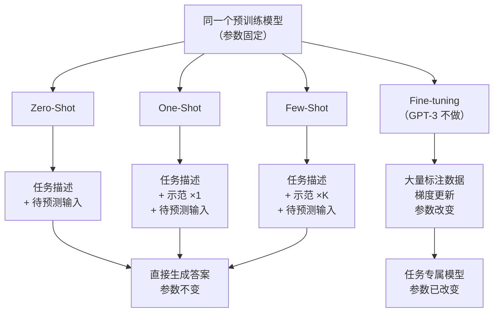

# GPT-3

> 对应论文：`paper/GPT3-Language-Models-are-Few-Shot-Learners.pdf`（Brown et al., 2020）
>
> 读这篇之前，建议先读 `Transformer.md` 和 `GPT.md`。这篇的重点不是架构本身，而是**规模改变了什么**，以及 GPT-3 提出的 In-Context Learning 范式。

---

## 1. 背景：为什么需要 GPT-3

### 1.1 "预训练 + 微调"范式的隐性代价

GPT-1 和 BERT 共同确立了一条 NLP 主流路径：先在海量无标注文本上做**预训练（Pre-training）**，再在每个任务的标注数据上做**微调（Fine-tuning）**。

这条路很有效，但有一个隐性代价：**每换一个任务，就要重新准备标注数据，重新训练一个任务专属的模型版本。**

你要做情感分类，需要标注几千条情感数据；你要做阅读理解，需要标注几万个问答对；你要做机器翻译，需要双语平行语料……当任务数量多时，这个成本难以承受。更重要的是，这意味着语言模型的"通用性"仍然有限——它必须被"告知"每个具体任务的边界，才能在那个任务上表现好。

### 1.2 GPT-3 的核心主张

Brown 等人的出发点是一个直觉：**人类不需要大量示例就能学会新任务。**

你给一个人看两三个例子，他就能举一反三——不需要"重新训练大脑"。GPT-3 的核心主张是：

> 当语言模型足够大时，只需在推理时的 prompt 里提供任务说明和少量示例，模型就能理解任务并正确作答，**不需要任何梯度更新，不需要任何标注数据**。

这种能力叫做 **In-Context Learning（上下文学习，ICL）**。它不是新的训练方式，而是一种推理方式——任务信息通过 prompt 传递，而不是通过梯度传递。

可以把 GPT-3 想象成一个读了几乎所有人类书籍的人。你把它叫过来，给他看两三个翻译例子，他就能翻译下一句话，不需要上翻译课、不需要做练习题。规模，让这件事变为可能。

### 1.3 "预训练 + 微调"与 ICL 的对比

| | 微调（Fine-tuning） | In-Context Learning |
|:---|:---|:---|
| 是否更新参数 | 是 | **否** |
| 需要标注数据 | 需要（每个任务单独准备） | 不需要（或只需极少示例） |
| 每个任务需要独立模型 | 是 | 否，共用同一个预训练模型 |
| 推理时的输入 | 普通文本 | 任务说明 + 示例 + 待预测输入 |
| 适用前提 | 无特殊要求 | 模型参数量要足够大 |

---

## 2. 架构：与 GPT-2 相同的地基，两处关键改动

### 2.1 延续 Decoder-Only 路线

GPT-3 的基础架构和 GPT-2 完全相同：

- **Decoder-Only Transformer**：只有解码器，没有编码器
- **Causal Masked Self-Attention**：每个 token 只能关注自身及之前的 token，不能看未来
- **自回归生成（Autoregressive Generation）**：逐 token 预测，每次生成以全部已有 token 为条件
- **Pre-norm**：Layer Normalization 放在残差块的输入端（而不是输出端），训练更稳定

如果你读过 `GPT.md`，这部分完全相同，不需要重新理解。

### 2.2 改动一：交替稠密与局部带状稀疏注意力

GPT-3 引入了一处架构改动，来自 Sparse Transformer（Child et al., 2019）：**在 Transformer 各层中，交替使用全稠密注意力（Dense Attention）和局部带状稀疏注意力（Locally Banded Sparse Attention）**。

先解释为什么需要这个改动。

标准 Causal Self-Attention 的显存复杂度是 $O(n^2)$，其中 $n$ 是序列长度。当 $n = 2048$ 时，注意力矩阵大小为 $2048 \times 2048$，已经相当可观。如果想支持更长的上下文，全注意力的成本以平方速度上升。

**稀疏注意力**的思路：不让每个 token 关注所有历史 token，而只关注一个局部窗口 $w$ 内的 token，窗口外直接跳过。

GPT-3 的交替方案：

- **稠密层（Dense Layer）**：每个 token 关注自身及之前所有 token，注意力范围 $\mathcal{N}_\text{dense}(i) = \{j \mid j \leq i\}$
- **稀疏层（Sparse Layer）**：每个 token 只关注局部带状窗口，注意力范围 $\mathcal{N}_\text{sparse}(i) = \{j \mid i - w \leq j \leq i\}$

两种层逐层交替：稠密、稀疏、稠密、稀疏……

这个设计的权衡：

| 方式 | 长程依赖 | 计算复杂度 |
|:---|:---|:---|
| 纯稠密 | 任意距离均可捕获 | $O(n^2)$ |
| 纯稀疏 | 只能捕获局部依赖 | $O(n \cdot w)$ |
| **交替（GPT-3）** | 稠密层全局、稀疏层局部，多层堆叠后信息仍可远程传播 | 约为纯稠密的一半 |

### 2.3 改动二：规模——8 个尺寸的模型族

GPT-3 论文训练了 8 个规模不同的模型（Table 2.1），以研究性能随规模的变化规律。所有模型均训练了 **300B tokens**，上下文窗口均为 **2048 tokens**，前馈层维度均为 $d_\text{ff} = 4 \times d_\text{model}$。

| 模型 | 参数量 | 层数 $n_\text{layers}$ | $d_\text{model}$ | 头数 $n_\text{heads}$ | $d_\text{head}$ | Batch Size |
|:---|:---:|:---:|:---:|:---:|:---:|:---:|
| GPT-3 Small | 125M | 12 | 768 | 12 | 64 | 0.5M |
| GPT-3 Medium | 350M | 24 | 1024 | 16 | 64 | 0.5M |
| GPT-3 Large | 760M | 24 | 1536 | 16 | 96 | 0.5M |
| GPT-3 XL | 1.3B | 24 | 2048 | 24 | 128 | 1M |
| GPT-3 2.7B | 2.7B | 32 | 2560 | 32 | 80 | 1M |
| GPT-3 6.7B | 6.7B | 32 | 4096 | 32 | 128 | 2M |
| GPT-3 13B | 13B | 40 | 5140 | 40 | 128 | 2M |
| **GPT-3 175B** | **175B** | **96** | **12288** | **96** | **128** | **3.2M** |

几个数字帮助建立直觉：

- GPT-3 Small（125M）和 BERT-Base（110M）参数量接近，是最小档
- GPT-3 175B 是 GPT-2（1.5B）的约 117 倍，是最大档
- 每个头的维度 $d_\text{head} = d_\text{model} / n_\text{heads}$，可以验算：$12288 / 96 = 128$ ✓

---

## 3. 训练数据：质量 > 数量

### 3.1 数据集构成（Table 2.2）

GPT-3 的训练数据来自 5 个来源，在训练时按权重采样，并非按原始数据量比例采样：

| 数据集 | Token 量 | 训练权重 | 训练 300B tokens 时被看次数 |
|:---|:---:|:---:|:---:|
| Common Crawl（过滤后） | 410B | 60% | 0.44 次 |
| WebText2 | 19B | 22% | 2.9 次 |
| Books1 | 12B | 8% | 1.9 次 |
| Books2 | 55B | 8% | 0.43 次 |
| Wikipedia | 3B | 3% | **3.4 次** |

可以发现一个规律：**高质量数据集被过采样**。Wikipedia 只有 3B tokens，但在训练过程中被模型看了约 3.4 次；Common Crawl 有 410B tokens，却只被看了 0.44 次——不到一遍。

### 3.2 数据质量过滤

原始 Common Crawl 质量参差不齐，论文做了三步处理：

1. **相似度过滤**：用高质量语料（WebText 等）训练一个分类器，把与高质量文本相似度低的 Common Crawl 文档过滤掉
2. **模糊去重**：在文档级别做 MinHash 去重，防止重复内容让模型"死记硬背"
3. **混入高质量语料**：加入 Books1、Books2、Wikipedia 等经过人工或编辑筛选的数据，直接提高训练数据的平均质量

这三步的核心逻辑是：**宁可少看一点 Common Crawl，也要多看几遍高质量的书籍和百科**。

---

## 4. In-Context Learning 的三种形式

这是 GPT-3 论文的核心贡献之一：对"推理时提供示例"这件事做了严格的分类定义。三种方式的共同特征是**不做任何梯度更新**。

### 4.1 Zero-Shot（0S）：只给任务描述

Prompt 里只说明任务是什么，不给任何示范例子：

```
Translate English to French:

Cheese =>
```

模型仅凭自然语言指令理解任务并生成答案。这要求模型在预训练阶段已经"见过"这类任务的输入输出模式。这是最难的设置，也是最贴近真实使用场景的设置。

### 4.2 One-Shot（1S）：给一个示范

Prompt 里加入一个完整的"输入 → 输出"示范，再给出待预测输入：

```
Translate English to French:

Sea Otter => Loutre de mer

Cheese =>
```

一个示范能告诉模型"格式是什么"——输出只是目标语言的翻译，不附带解释。这也是最接近向人类解释任务时的方式（你通常也只给一个例子）。

### 4.3 Few-Shot（FS）：给 K 个示范

Prompt 里提供 $K$ 个示范，$K$ 通常在 10 到 100 之间，受上下文窗口硬性限制：

```
Translate English to French:

Sea Otter => Loutre de mer
Peppermint => Menthe poivrée
Plush girafe => Girafe peluche

Cheese =>
```

示范越多，模型对任务格式和分布的理解越精准，性能通常越好。$K$ 的上限由上下文窗口（2048 tokens）决定：

$$
K \leq \left\lfloor \frac{n_\text{ctx} - |\text{任务描述}| - |\text{待预测输入}|}{|\text{单个示范}|} \right\rfloor
$$

假设任务描述 50 tokens、单个示范平均 40 tokens、待预测输入 20 tokens，则：

$$
K \leq \left\lfloor \frac{2048 - 50 - 20}{40} \right\rfloor \approx 49
$$

实际论文中常用 $K = 10 \sim 50$，具体取决于任务。

### 4.4 关键：三种形式均不更新参数

```
微调：读入示例 → 计算 loss → 反向传播 → 更新权重 → 下次推理参数已改变

ICL ：读入示例 → 作为 prompt 上下文 → 直接生成答案 → 参数始终不变
```

ICL 为什么有效？论文没有给出完整的理论解释，但一个合理的直觉是：预训练语料本身包含大量"示例 → 结论"结构，模型在训练中已经学会了如何利用这种模式。示例不是在"教"模型，而是在"唤醒"模型已有的能力。

---

## 5. 三种 ICL 设置与 Fine-tuning 的对比

下图展示了 Zero-Shot、One-Shot、Few-Shot 与传统 Fine-tuning 在 Prompt 结构和参数更新上的根本区别：



三条 ICL 路径（Zero/One/Few-Shot）从同一个预训练模型出发，到达同一个推理终点——参数始终不变，只有 prompt 的结构不同。Fine-tuning 则走向另一个终点：参数被任务数据修改了。

---

## 6. 规模规律与实验结果

### 6.1 训练损失的 Power-Law 规律

论文的 Figure 3.1 展示了一个核心发现：在训练过程中，语言模型的交叉熵损失随计算量的增长遵循幂律（Power-Law）关系：

$$
L = 2.57 \cdot C^{-0.048}
$$

其中 $L$ 是验证集上的交叉熵损失，$C$ 是训练所用的总计算量（以 PetaFLOP/s-days 计）。

这个公式说明：**损失的下降是平滑、可预测的**——投入更多计算，损失就更低，没有突然的拐点。这个规律对于判断"我需要多大的模型、多少数据、训练多久"非常有指导意义（即 Scaling Laws）。

### 6.2 更大的模型，Few-Shot 提升更明显

论文 Figure 1.2 展示了一个关键规律：在同一任务上（去除单词中的随机符号），随着 $K$（示范数量）的增加，**175B 模型的精度提升远比 1.3B 和 13B 模型陡峭**。

换句话说：**模型越大，越善于利用上下文中的信息**。小模型加示范帮助有限，大模型加示范能获得显著收益。这也是为什么 ICL 范式必须配合大模型才能发挥作用。

论文 Figure 1.3 进一步在 42 个准确率类基准上的聚合结果也显示：zero-shot 性能随规模稳定提升，few-shot 提升更快、更陡。

### 6.3 具体结果

**LAMBADA（完形填空，预测段落最后一个词）**：

| 设置 | 准确率 |
|:---|:---:|
| Zero-Shot | 76.2% |
| One-Shot | 72.5% |
| Few-Shot | **86.4%** |
| 此前 SOTA | 68.0% |

Few-Shot 的 86.4% 大幅超越此前最优结果，而且有趣的是 one-shot 反而略低于 zero-shot——这说明 ICL 并不是"示范越多越好"，示范的质量和与任务的匹配度同样重要。

**PTB 语言建模（Penn Treebank，困惑度 PPL，越低越好）**：

| 设置 | PPL |
|:---|:---:|
| GPT-3 Zero-Shot | **20.50** |
| 当时 SOTA（微调） | 35.76 |

GPT-3 在零示范下领先微调后的 SOTA 超过 15 个 PPL 点。这个结果说明，在语言建模本身这件事上，规模本身就能带来质的飞跃，不需要任何任务专属的微调。

---

## 7. GPT、GPT-2、GPT-3 的对比

| | GPT（2018） | GPT-2（2019） | GPT-3（2020） |
|:---|:---:|:---:|:---:|
| 参数量 | 117M | 1.5B | 175B |
| 训练数据量 | ~1B tokens | ~40B tokens | 300B tokens |
| 上下文长度 | 512 | 1024 | **2048** |
| 注意力类型 | 全稠密 | 全稠密 | **交替稠密 + 局部稀疏** |
| 位置编码 | 可学习绝对位置 | 可学习绝对位置 | 可学习绝对位置 |
| 归一化位置 | Post-norm | **Pre-norm** | Pre-norm（同 GPT-2） |
| 主要能力 | 微调迁移 | Zero-Shot 初探 | Zero / One / Few-Shot ICL |
| 核心贡献 | 预训练 + 微调范式 | Zero-Shot 可行性 | **In-Context Learning 范式** |

架构路线一脉相承：Decoder-Only + Causal Masked Attention + 自回归生成。每一代的核心变化是规模，推理范式的转变是规模带来的涌现。

---

## 8. 代码示例

### 8.1 用 Prompt 做 Few-Shot 推理（伪代码）

下面的伪代码展示了如何用 prompt 结构实现 few-shot 推理，不涉及模型内部实现：

```python
# 以"英译法"任务为例，演示 few-shot prompt 的构建逻辑
# （伪代码，假设 model.generate 接受文本并返回续写）

def build_few_shot_prompt(task_description, examples, query):
    """
    构建 few-shot prompt。
    task_description: 任务说明（自然语言）
    examples: [(input_text, output_text), ...] 示范对列表
    query: 待预测的输入
    """
    lines = [task_description, ""]           # 任务描述后空一行
    for inp, out in examples:
        lines.append(f"{inp} => {out}")      # 每个示范占一行
    lines.append("")                         # 示范后空一行
    lines.append(f"{query} =>")             # 待预测输入，留空让模型补全
    return "\n".join(lines)


# 构建一个 few-shot prompt（K=3）
prompt = build_few_shot_prompt(
    task_description="Translate English to French:",
    examples=[
        ("Sea Otter",    "Loutre de mer"),
        ("Peppermint",   "Menthe poivrée"),
        ("Plush girafe", "Girafe peluche"),
    ],
    query="Cheese",
)

# 把 prompt 送给模型，模型续写出答案
answer = model.generate(prompt, max_new_tokens=10, stop_at="\n")
# 期望输出：Fromage
```

关键点：模型看到 `Cheese =>` 后，根据上下文中前 3 个示范的模式，自然地补全法语翻译。全程**无梯度更新**，prompt 就是全部的"任务信息"。

### 8.2 GPT-3 架构关键超参（以 175B 为例）

```python
# GPT-3 175B 的关键超参（来自论文 Table 2.1）
GPT3_175B_CONFIG = {
    "n_params":      175_000_000_000,  # 总参数量
    "n_layers":      96,               # Transformer 层数（稠密和稀疏各 48 层，交替排布）
    "d_model":       12288,            # 隐藏层维度
    "n_heads":       96,               # 注意力头数
    "d_head":        128,              # 每个头的维度，= d_model / n_heads = 12288 / 96
    "d_ff":          49152,            # 前馈层维度，= 4 * d_model = 4 * 12288
    "n_ctx":         2048,             # 上下文窗口长度（最大 K 受此限制）
    "vocab_size":    50257,            # 与 GPT-2 相同的 BPE 词表
    "batch_size":    3_200_000,        # token 级 batch size，3.2M tokens/step
    "learning_rate": 6e-5,             # 最大学习率（带 cosine decay）
    "train_tokens":  300_000_000_000,  # 所有 8 个模型统一训练 300B tokens
}

# 验证关键关系
assert GPT3_175B_CONFIG["d_head"] == (
    GPT3_175B_CONFIG["d_model"] // GPT3_175B_CONFIG["n_heads"]
)  # 128 == 12288 // 96  ✓

assert GPT3_175B_CONFIG["d_ff"] == 4 * GPT3_175B_CONFIG["d_model"]  # 49152 == 4 * 12288  ✓
```

### 8.3 交替稀疏注意力的掩码逻辑（简化伪代码）

```python
import torch

def get_attention_mask(seq_len, layer_idx, window_size=256):
    """
    根据层编号决定使用稠密还是稀疏因果掩码。
    layer_idx 为偶数 → 稠密层（标准因果掩码）
    layer_idx 为奇数 → 稀疏层（局部带状因果掩码）
    """
    # 基础因果掩码：上三角置 -inf，防止看到未来 token
    causal_mask = torch.full((seq_len, seq_len), float("-inf"))
    causal_mask = torch.triu(causal_mask, diagonal=1)   # 上三角 = -inf，下三角 = 0

    if layer_idx % 2 == 0:
        # 偶数层：稠密注意力，直接返回因果掩码
        return causal_mask

    else:
        # 奇数层：稀疏注意力，在因果掩码基础上，还要屏蔽窗口外的历史 token
        for i in range(seq_len):
            # 窗口左边界（超出窗口的历史 token 也要屏蔽）
            left_boundary = max(0, i - window_size + 1)
            if left_boundary > 0:
                causal_mask[i, :left_boundary] = float("-inf")
        return causal_mask


# 在前向传播中使用
def forward_with_alternating_attention(x, n_layers, window_size=256):
    seq_len = x.size(1)
    for layer_idx in range(n_layers):
        mask = get_attention_mask(seq_len, layer_idx, window_size)
        x = transformer_block(x, mask=mask)   # 每层用对应的掩码
    return x
```

---

## 9. 局限性

### 9.1 推理成本极高

175B 参数以 float16 存储需要约 **350 GB 显存**，远超单张 GPU 的容量（A100 最大 80 GB）。实际推理需要多台高端 GPU 配合模型并行，这在 2020 年意味着只能通过 API 访问，无法本地部署。

这个限制推动了后续两个研究方向：**量化**（用更低精度存储权重，如 int8/int4）和**高效小模型**（用更好的数据和训练方法让更小的模型达到接近效果，如 LLaMA 系列）。

### 9.2 知识截止于训练数据

GPT-3 的参数在预训练结束后就固定了。训练数据截止日期之后发生的事情，模型一概不知。这催生了**检索增强生成（RAG）**——在 prompt 里动态插入外部文档，但这只是绕过，不是根本解决。

### 9.3 Prompt 敏感性

Few-Shot 示例的**排列顺序**会显著影响结果——同样的 $K$ 个示例，换一种顺序，准确率可能相差超过 10 个百分点。示例的**选择**本身也有影响。这意味着 ICL 的表现在某种程度上依赖 prompt 工程，而不是完全由模型能力决定。

### 9.4 "有能力但不对齐"

GPT-3 的训练目标是预测下一个 token，没有被明确告知"要有帮助"或"不要有害"。它有能力完成各种任务，但在"应该怎么做"这件事上缺乏约束。OpenAI 后续通过 **RLHF（人类反馈强化学习）** 训练了 InstructGPT，再到 ChatGPT，才让模型的输出与人类期望对齐——这是 GPT-3 到 ChatGPT 这一步的关键技术。

---

## 10. 常见混淆问题

**Q：Few-Shot Learning 和传统机器学习里的 Few-Shot Learning 是一回事吗？**

不是。传统机器学习里的 Few-Shot Learning 是指在少量样本上**训练**模型（会更新参数，通常配合 meta-learning）。GPT-3 的 Few-Shot 是指在 prompt 里放几个示例进行**推理**，参数始终不变。同一个名字，含义有本质差异。

**Q：示例放进 prompt 里，模型是在"学习"吗？**

不是传统意义上的学习，没有梯度更新。更准确的描述是：模型根据上下文信息调整了对当前任务的"理解"（在激活值层面），但这种调整只存在于当前 forward pass，下一次推理又从固定参数出发。

**Q：为什么 One-Shot 在 LAMBADA 上的结果（72.5%）反而低于 Zero-Shot（76.2%）？**

这说明 ICL 不是"示范越多越好"的简单关系。加入一个示范可能引入噪声，或者让模型对任务格式产生错误预期，反而干扰了 Zero-Shot 下的自然语言理解。示范的质量和与任务的匹配程度同样关键。

**Q：GPT-3 的稀疏注意力和后续的 NSA（原生稀疏注意力）是同一个东西吗？**

不是。GPT-3 用的是固定模式的局部带状稀疏——窗口大小预先设定，模式不随输入变化。NSA 等后续工作有更灵活的稀疏模式（基于内容动态选择关注哪些 token），且专门针对现代 GPU 硬件做了对齐优化。GPT-3 的方案是早期的、相对简单的版本。

**Q：GPT-3 发布后，为什么开源社区还在追求更小的模型？**

175B 的推理成本决定了它只能在服务器端、通过 API 使用。LLaMA 等工作的目标是：用更高质量的数据和更充分的训练，让 7B、13B 这样的模型在多数任务上达到接近 GPT-3 的水平，同时支持本地部署和个人微调。规模不是唯一路径，**数据质量 + 训练效率**同样关键。

---

## 11. 读完这篇之后，你应该能回答这些问题

- In-Context Learning 和 Fine-tuning 的根本区别是什么？ICL 会更新模型参数吗？
- Zero-Shot、One-Shot、Few-Shot 三种方式的 Prompt 结构各是什么样的？它们的共同特征是什么？
- GPT-3 在架构上与 GPT-2 有哪些改动？交替稠密与稀疏注意力的目的是什么？
- 稠密层和稀疏层各自关注哪些 token？用公式表示它们的注意力范围。
- Few-Shot 示范数量 $K$ 受什么限制？以 GPT-3 的上下文窗口为例估算 $K$ 的上限。
- GPT-3 的训练数据由哪 5 个来源组成？为什么高质量数据集被过采样？
- Power-Law 规律 $L = 2.57 \cdot C^{-0.048}$ 说明了什么？
- 论文 Figure 1.2 展示的规律是什么？为什么这对 ICL 范式很重要？
- GPT-3 在 LAMBADA 和 PTB 上各取得了什么结果？
- GPT-3 的"有能力但不对齐"问题是通过什么后续工作解决的？

---

## 参考资料

- GPT-3 论文：`paper/GPT3-Language-Models-are-Few-Shot-Learners.pdf`，Brown et al., 2020，https://arxiv.org/abs/2005.14165
- Sparse Transformer（GPT-3 稀疏注意力的来源）：Child et al., 2019，https://arxiv.org/abs/1904.10509
- Scaling Laws for Neural Language Models：Kaplan et al., 2020，https://arxiv.org/abs/2001.08361
- InstructGPT（RLHF 对齐）：Ouyang et al., 2022，https://arxiv.org/abs/2203.02155
