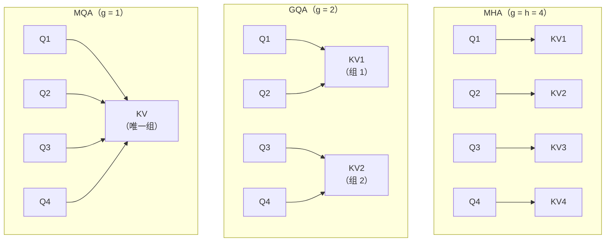

# GQA：Grouped Query Attention

> 对应论文：`paper/GQA-Grouped-Query-Attention.pdf`
> GQA: Training Generalized Multi-Query Transformer Models from Multi-Head Checkpoints，Ainslie et al.，Google Research，2023
> https://arxiv.org/abs/2305.13245

---

## 1. 背景：MQA 的质量损失能否弥补？

上一篇 MQA 讲到，把所有 Query 头的 KV 合并成一组，能把 KV Cache 压缩 $h$ 倍，但代价是质量有所下降——所有头共享同一套特征提取，灵活性损失了。

能不能找一个中间方案：**既不像 MHA 那样 $h$ 组 KV 全部独立，也不像 MQA 那样极端地压缩到 1 组，而是取一个适中的数目**？

这就是 **GQA（Grouped Query Attention，分组查询注意力）** 的出发点。

GQA 论文还直接面对了生产中的另一个实际问题：工业界已经存在大量训练好的 MHA 模型（比如 T5），重新从头训练一个 MQA 或 GQA 模型代价极大。有没有办法把已有的 MHA 检查点直接"转换"成 GQA，只用少量数据继续训练就能达到接近 GQA 原生训练的效果？

GQA 论文的回答是：**可以，而且转换方法不止一种，效果差异显著。**

---

## 2. GQA 的核心思想：Query 头分组，每组共享一对 KV

GQA 把 $h$ 个 Query 头分成 $g$ 组，每组包含 $h/g$ 个 Query 头，**每组共享同一对 K 和 V**。

可以把这个机制理解成图书馆的共享参考室。假设图书馆有 8 位读者（Query 头），但参考资料只有 4 套（4 组 KV）。每两位读者共用一套资料——他们可以各自提不同的问题（不同的 Query 投影），但他们查阅的底层资料是相同的。不同参考室之间的资料则各有侧重（句法、语义、指代……）。相比 MQA 的"8 人挤一个参考室"，GQA 的灵活性明显更高。

用一个具体的例子来说：假设有 8 个 Query 头，分成 4 组，每组 2 个 Query 头：

```
Query 头:  Q1  Q2 | Q3  Q4 | Q5  Q6 | Q7  Q8
                 ↓        ↓        ↓        ↓
KV 组:      KV1      KV2      KV3      KV4
```

Q1 和 Q2 共享 KV1，Q3 和 Q4 共享 KV2，以此类推。

这样，KV Cache 的大小从 MHA 的 $h$ 组变成了 $g$ 组（$g < h$），压缩比是 $h/g$。

---

## 3. 三种模式的统一视角

GQA 把 MHA 和 MQA 统一成了同一个框架下的特例：

- **GQA-H**（组数 $g = h$）：每头独立 KV，等价于 **MHA**
- **GQA-G**（$1 < g < h$）：中间状态，即标准的 **GQA**
- **GQA-1**（$g = 1$）：所有头共享 1 组 KV，等价于 **MQA**

用 Mermaid 图展示三种模式下 KV 头的分配：



| 模式 | 组数 $g$ | KV Cache 大小 | 质量 | 推理速度 |
|:---|:---:|:---:|:---:|:---:|
| MHA | $h$ | 最大（$h$ 组） | 最好 | 最慢 |
| GQA | $1 < g < h$ | 折中（$g$ 组） | 接近 MHA | 接近 MQA |
| MQA | $1$ | 最小（1 组） | 有损失 | 最快 |

---

## 4. 从公式看 GQA

MHA 中第 $i$ 个头，每头有自己独立的 $W_i^K$ 和 $W_i^V$：

$$
\text{head}_i = \text{Attention}(Q W_i^Q,\; K W_i^K,\; V W_i^V)
$$

GQA 中第 $i$ 个头属于第 $\lfloor i \cdot g / h \rfloor$ 组，同组内的 Query 头共用一套 $W^K$ 和 $W^V$：

$$
\text{head}_i = \text{Attention}(Q W_i^Q,\; K W_{\lfloor i \cdot g / h \rfloor}^K,\; V W_{\lfloor i \cdot g / h \rfloor}^V)
$$

关键点：**$W^Q$ 仍然各头独立**，只有 $W^K$ 和 $W^V$ 在组内共享。Query 侧的多样性完全保留，压缩只发生在 KV 侧。

最终把所有头的结果拼接并投影：

$$
\text{GQA}(Q, K, V) = \text{Concat}(\text{head}_1, \ldots, \text{head}_h)\, W^O
$$

---

## 5. 代码实现

```python
import torch
import math

class GroupedQueryAttention(torch.nn.Module):
    def __init__(self, d_model, n_heads, n_kv_heads):
        super().__init__()
        assert n_heads % n_kv_heads == 0, "n_heads 必须是 n_kv_heads 的整数倍"
        self.n_heads = n_heads
        self.n_kv_heads = n_kv_heads
        self.n_rep = n_heads // n_kv_heads   # 每组内有多少个 Query 头
        self.head_dim = d_model // n_heads

        # Q 的投影：n_heads 个独立头，每头维度为 head_dim
        self.W_Q = torch.nn.Linear(d_model, n_heads * self.head_dim, bias=False)
        # K/V 的投影：只有 n_kv_heads 组，参数量大幅减少
        self.W_K = torch.nn.Linear(d_model, n_kv_heads * self.head_dim, bias=False)
        self.W_V = torch.nn.Linear(d_model, n_kv_heads * self.head_dim, bias=False)
        self.W_O = torch.nn.Linear(d_model, d_model, bias=False)

    def forward(self, x, mask=None):
        B, T, _ = x.shape

        # Q: (B, n_heads, T, head_dim)
        Q = self.W_Q(x).view(B, T, self.n_heads, self.head_dim).transpose(1, 2)
        # K/V: (B, n_kv_heads, T, head_dim)，比 MHA 少了 n_rep 倍的参数
        K = self.W_K(x).view(B, T, self.n_kv_heads, self.head_dim).transpose(1, 2)
        V = self.W_V(x).view(B, T, self.n_kv_heads, self.head_dim).transpose(1, 2)

        # 将 K/V 扩展到 n_heads：每组 KV 重复 n_rep 次，让矩阵乘法维度对齐
        # repeat_interleave 效果：[KV1, KV2] → [KV1, KV1, KV2, KV2]（n_rep=2 时）
        # 注意：这里只是计算时临时扩展，KV Cache 存储仍然只有 n_kv_heads 组
        K = K.repeat_interleave(self.n_rep, dim=1)   # (B, n_heads, T, head_dim)
        V = V.repeat_interleave(self.n_rep, dim=1)

        # 标准 Scaled Dot-Product Attention，公式与 MHA 完全相同
        scores = (Q @ K.transpose(-2, -1)) / math.sqrt(self.head_dim)
        if mask is not None:
            scores = scores + mask   # Causal mask：-inf 位置在 softmax 后变为 0
        weights = scores.softmax(dim=-1)
        out = weights @ V   # (B, n_heads, T, head_dim)

        # 合并多头，过输出投影
        out = out.transpose(1, 2).contiguous().view(B, T, -1)
        return self.W_O(out)
```

关键参数示例：
- `n_heads = 32`，`n_kv_heads = 8`：LLaMA 2 70B 的配置，`n_rep = 4`，每 4 个 Query 头共享 1 对 KV
- `n_heads = 128`，`n_kv_heads = 8`：LLaMA 3.1 405B 的配置，`n_rep = 16`，KV Cache 压缩 16 倍

---

## 6. 从 MHA 检查点转化为 GQA：Uptraining

### 6.1 问题：已有的 MHA 模型怎么处理？

重新从头训练一个 GQA 模型代价极高。论文提出了一种 **Uptraining** 流程：把现有 MHA 检查点直接转换成 GQA 结构，然后用少量数据继续训练，让模型适应新的结构。

整个流程分两步：

1. **结构转换（Conversion）**：从 MHA 的 $h$ 个 KV 头，合并成 $g$ 组
2. **Uptraining**：用原始训练数据的一小部分继续训练，恢复质量

### 6.2 三种转换方法的对比

最关键的问题是：如何把同一组内的 $h/g$ 个 KV 头合并成 1 个？论文比较了三种方法（Figure 4）：

| 方法 | 描述 | 平均分 |
|:---|:---|:---:|
| **Mean Pooling**（均值池化） | 取组内所有 KV 头参数矩阵的均值 | **约 55.4**（最优） |
| **First**（取第一个） | 只保留组内第一个头的参数 | 约 55.2 |
| **Random**（随机初始化） | 丢弃原始参数，随机初始化 | 约 54.9（最差） |

**为什么 Mean Pooling 最优？** 因为它保留了预训练信息最多。MHA 的每个 KV 头都携带了训练过程中学到的特征表示；取均值相当于把同组内所有头的"知识"做了一次融合，而不是武断地选其中一个或丢弃全部。Random 初始化则完全抛弃了预训练信息，需要从零学起，效果最差。

Mean Pooling 的公式：

$$
W_{\text{group}}^K = \frac{1}{h/g} \sum_{i \in \text{group}} W_i^K, \qquad W_{\text{group}}^V = \frac{1}{h/g} \sum_{i \in \text{group}} W_i^V
$$

### 6.3 Uptraining 比例

转换完成后，需要多少数据继续训练才能恢复质量？论文用"Uptraining 比例 $\alpha$"（占原始预训练 token 数的百分比）做了系统实验（Figure 5）：

- **$\alpha = 0$（不继续训练）**：GQA 已经有合理的基线质量，MQA 则相对更差，说明 GQA 的结构转换损失更小
- **$\alpha = 0.05$（5%）**：GQA 和 MQA 都基本收敛，GQA 收敛更快
- **$\alpha > 0.1$（10% 以上）**：边际收益递减，额外训练不再有明显提升

5% 的 Uptraining 在论文的实验规模下约花费 **600 TPUv3 chip-days**，相比从头训练大幅降低了成本。

**结论**：使用 Mean Pooling 转换 + 5% Uptraining，是将已有 MHA 检查点迁移到 GQA 的推荐方案。

---

## 7. 推理速度与质量的量化对比

### 7.1 实验结果（Table 1）

论文基于 T5.1.1 架构（JAX/Flax 实现），在 CNN/DailyMail、arXiv、PubMed、MediaSum、MultiNews（摘要任务）、WMT 翻译、TriviaQA 问答等数据集上进行了系统评测。以下是核心结果：

| 模型 | 推理时间（秒/样本） | 平均性能分 | 备注 |
|:---|:---:|:---:|:---|
| MHA-Large | 0.37s | 46.0 | 基准：小模型，MHA |
| MHA-XXL | 1.51s | 47.2 | 大模型，MHA，质量最好，但速度最慢 |
| MQA-XXL（uptrained 5%） | 0.24s | 46.6 | 速度最快，但质量比 MHA-XXL 差 0.6 分 |
| **GQA-8-XXL（uptrained 5%）** | **0.28s** | **47.1** | **质量接近 MHA-XXL，速度接近 MQA** |

GQA-8-XXL 的关键洞察：

- 比 MHA-XXL **快 5.4 倍**（1.51s → 0.28s），质量仅差 0.1 分（47.1 vs 47.2）
- 比 MQA-XXL **慢 0.04s**，但质量高出 0.5 分（47.1 vs 46.6）
- 甚至比 **MHA-Large** 更快（0.28s vs 0.37s），且性能更高（47.1 vs 46.0）

这个结果说明：GQA-8 在速度和质量之间取得了明显最优的 trade-off——用 XXL 模型的参数容量，只用接近 MQA 的推理代价，就能得到接近 MHA 的质量。

### 7.2 组数 $g$ 对推理速度的影响（Figure 6）

论文还系统测试了不同 GQA 组数对推理延迟的影响，得出以下规律：

| 组数 $g$ | 对应形式 | 推理时间 |
|:---:|:---:|:---:|
| 1 | MQA | 0.24s（最快） |
| 4 | GQA-4 | 略慢于 MQA |
| **8** | **GQA-8** | **约 0.28s，仍远快于 MHA** |
| 16+ | GQA-16 以上 | 时间迅速上升，接近 MHA |

**为什么 8 组是工业 sweet spot？** 从 Figure 6 的曲线来看，组数从 1 增加到 8 时，推理时间只有轻微上升（从 0.24s 到 0.28s），但模型质量提升显著；而组数继续从 8 增加到 MHA（32 组），推理时间急剧上升，质量增益却越来越小。8 这个数字恰好落在"速度下降斜率陡增"的拐点之前，是性价比最高的位置。这解释了为什么几乎所有工业落地模型都选择了 $n\_kv\_heads = 8$。

---

## 8. GQA 在实际模型中的配置

| 模型 | n_heads | n_kv_heads | n_rep | KV Cache 压缩比 |
|:---|:---:|:---:|:---:|:---:|
| LLaMA 2 7B（MHA） | 32 | 32 | 1 | 1× |
| LLaMA 2 70B | 64 | 8 | 8 | 8× |
| LLaMA 3 8B | 32 | 8 | 4 | 4× |
| LLaMA 3.1 405B | 128 | 8 | 16 | 16× |
| Mistral 7B | 32 | 8 | 4 | 4× |
| Qwen2.5 72B | 64 | 8 | 8 | 8× |

`n_kv_heads = 8` 已经成为工业标准——无论模型大小如何，KV 头数几乎统一选择 8，这与 GQA 论文 Figure 6 的实验结论高度吻合。

**适用范围说明**：论文明确指出，GQA 只应用于 Decoder 的**自注意力**和**Cross-Attention**，不应用于 Encoder 的自注意力。原因在于 Encoder 并行处理整个输入序列，内存带宽不是主要瓶颈；而 Decoder 在推理时逐 token 生成，KV Cache 的读写带宽才是性能瓶颈所在。

---

## 9. 为什么 GQA 的质量损失比 MQA 小得多？

MQA 里所有 32 个 Query 头共享 1 对 KV，等于是说"图书馆里 32 位读者只能看同一套资料"，差异化完全靠 Query 侧。

GQA 里每 4 个 Query 头共享 1 对 KV（以 n_rep=4 为例），每组之间的 KV 是不同的。这意味着：

- **组间**：不同组的 KV 可以学到不同类型的特征（句法关系、语义关系、代词指代……）
- **组内**：同组的 4 个 Query 头用相同的 KV，但通过不同的 Query 投影去"问不同的问题"

这种设计保留了 MHA 的大部分表达能力，同时把 KV 数量压缩到了可接受的范围。

---

## 10. 常见混淆

**Q：GQA 是把 K 和 V 复制了 n_rep 份存进 KV Cache 吗？**

不是。**KV Cache 里只存 n_kv_heads 组 KV**，是在实际做注意力计算时（`repeat_interleave`）才临时扩展到 n_heads 份。这个"复制"只是为了让矩阵乘法的维度对齐，不影响存储量。KV Cache 的节省是真实的。

**Q：GQA 的 Q 还是每头独立的吗？**

是的。每个 Query 头有独立的 $W_i^Q$，Query 侧的多样性完全保留，只有 KV 侧做了合并。

**Q：n_kv_heads 越少越好吗？**

不是。n_kv_heads 越少，KV Cache 越小，但质量损失也越大。n_kv_heads = 1 就是 MQA，质量损失明显。论文的实验数据表明，8 组是工业上最优的折中点——从 1 到 8 的质量增益大，从 8 到 MHA 的推理代价增益小。

**Q：GQA 和 MLA 哪个更好？**

两者解决的是相同问题（KV Cache 压缩），但方式不同。GQA 通过减少 KV 头数量压缩，结构简单，工程实现成熟。MLA（DeepSeek 提出）通过低秩矩阵分解压缩，理论压缩率更高（可达 93%），但实现更复杂。详见 `MLA.md`。

---

## 11. 读完这篇之后，你应该能回答这些问题

- GQA、MHA、MQA 是什么关系？GQA-1 等价于什么？GQA-H 等价于什么？
- 在代码里，GQA 是怎么实现"n_kv_heads 组 KV 服务 n_heads 个 Query 头"的？`repeat_interleave` 在这里起什么作用？为什么这不会增加 KV Cache 的存储量？
- 将 MHA 检查点转换为 GQA 的三种方法是什么？为什么 Mean Pooling 效果最好？
- Uptraining 比例为什么选 5%？继续增加比例会发生什么？
- 根据论文 Table 1，GQA-8-XXL 和 MHA-XXL、MQA-XXL 相比，推理时间和质量各是多少？这说明了什么？
- 为什么工业界几乎统一选择 n_kv_heads = 8？用 Figure 6 的结论解释。
- GQA 为什么只用在 Decoder，而不用在 Encoder？

---

## 参考资料

- 原始论文：`paper/GQA-Grouped-Query-Attention.pdf`
- https://arxiv.org/abs/2305.13245
- 上一篇：`MQA.md`（Multi-Query Attention，KV Cache 压缩的第一步）
- 下一篇：`MLA.md`（Multi-head Latent Attention，低秩 KV 压缩）
