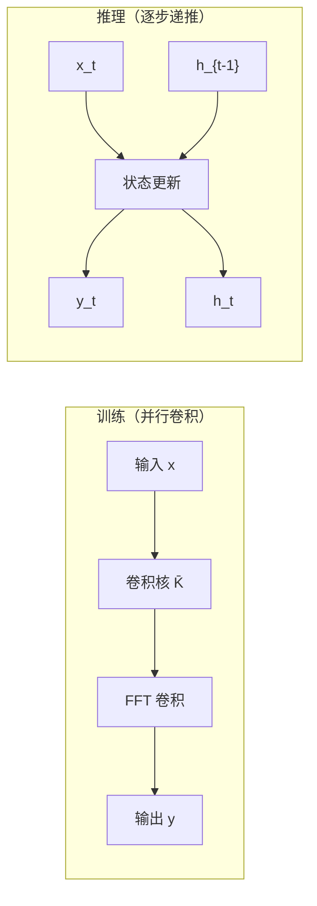
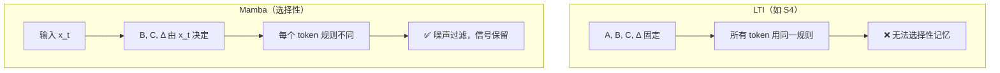
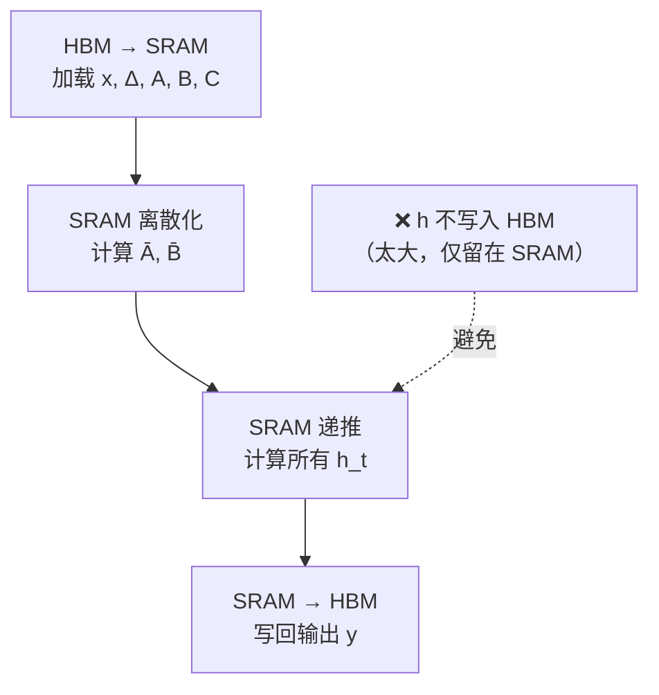
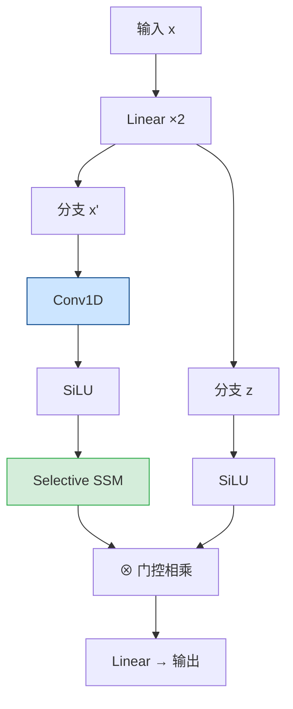
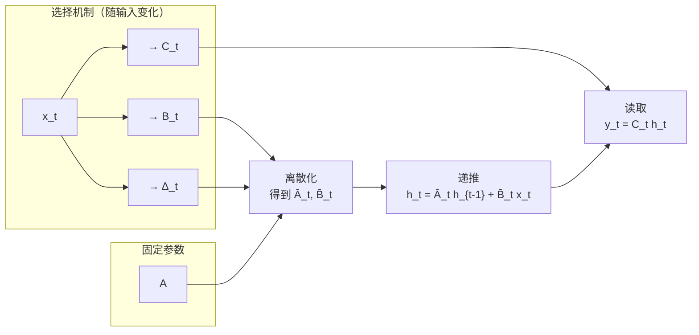

# Mamba：用选择性状态空间超越 Transformer

> 对应论文：`paper/Mamba-Linear-Time-Sequence-Modeling-Selective-SSM.pdf`
> Mamba: Linear-Time Sequence Modeling with Selective State Spaces，Gu & Dao，2023
> https://arxiv.org/abs/2312.00752

---

## 1. 背景：线性 Attention 的天花板

读完 RWKV 和 GLA，你已经见过了**线性 Attention 的基本范式**：用一个递推隐藏状态代替 KV Cache，训练时并行、推理时像 RNN 一样 $O(1)$ 更新一步。

但这条路线有一个难以回避的结构性问题：

**RWKV 的指数衰减权重、GLA 的数据相关门控——这些机制本质上都是"时间不变"的，即序列中每个位置的转移规则不会根据当前内容做本质改变。** 这让它们很难做到"选择性记忆"：遇到重要信息时多记，遇到噪声时主动遗忘。

用一个更具体的例子来说明这个问题：

> 序列：`A 1 B 2 C 3 D ??? 噪声 噪声 噪声 A`
> 任务：看到第二次 `A` 时，输出 `1`（归纳头任务）

LTI（线性时不变）模型必须把整个历史压缩进一个固定大小的状态，而不能有选择地只记住 `A→1` 这个映射、忽略中间所有噪声。实验证明，LTI 模型（包括 RWKV、RetNet 这类架构）在这类需要**内容感知选择**的任务上表现很差。

这正是 Mamba 要解决的问题：**让 SSM 的参数随输入内容动态变化**，从而实现真正的选择性记忆。

---

## 2. 从状态空间模型说起

Mamba 建立在**结构化状态空间模型（Structured State Space Model，SSM）**之上。要理解 Mamba 的创新，必须先搞清楚 SSM 是什么。

### 2.1 连续时间系统

SSM 起源于控制论中的线性动力系统。用最简洁的形式描述：一个系统接收信号 $x(t)$，维护一个隐藏状态 $h(t)$，输出 $y(t)$：

$$
h'(t) = \boldsymbol{A} h(t) + \boldsymbol{B} x(t) \tag{1a}
$$

$$
y(t) = \boldsymbol{C} h(t) \tag{1b}
$$

其中 $h'(t)$ 是 $h$ 对时间的导数，$\boldsymbol{A} \in \mathbb{R}^{N \times N}$ 是状态转移矩阵，$\boldsymbol{B} \in \mathbb{R}^{N \times 1}$、$\boldsymbol{C} \in \mathbb{R}^{1 \times N}$ 是输入/输出投影。

可以把这个系统理解成一个**有记忆的信号处理器**：
- 状态 $h(t)$ 是记忆，它携带了历史信息
- 新输入 $x(t)$ 不断更新记忆
- 输出 $y(t)$ 是从当前记忆中读取的信息

### 2.2 离散化：从连续到序列

神经网络处理的是离散序列（token by token），需要把连续系统（1a/1b）转换成离散递推形式。这一步称为**离散化**。

论文采用**零阶保持（Zero-Order Hold，ZOH）**规则，引入一个**步长参数** $\Delta$（读作 delta），表示相邻两个时间步之间的间隔：

$$
\bar{\boldsymbol{A}} = \exp(\Delta \boldsymbol{A}) \tag{4a}
$$

$$
\bar{\boldsymbol{B}} = (\Delta \boldsymbol{A})^{-1}(\exp(\Delta \boldsymbol{A}) - \boldsymbol{I}) \cdot \Delta \boldsymbol{B} \tag{4b}
$$

离散化之后，系统变成：

$$
h_t = \bar{\boldsymbol{A}} h_{t-1} + \bar{\boldsymbol{B}} x_t \tag{2a}
$$

$$
y_t = \boldsymbol{C} h_t \tag{2b}
$$

这就是一个标准的线性 RNN 递推，每个时间步只需要一次矩阵乘法。

### 2.3 SSM 的两种计算模式

离散 SSM 有一个优雅的性质：同一套参数，**可以用两种等价的方式计算**。

**模式一：循环（Recurrence）** — 按时间步一步步递推，适合推理：

$$
h_t = \bar{\boldsymbol{A}} h_{t-1} + \bar{\boldsymbol{B}} x_t, \quad y_t = \boldsymbol{C} h_t
$$

**模式二：全局卷积（Global Convolution）** — 预先计算卷积核，再做并行卷积，适合训练：

$$
\bar{\boldsymbol{K}} = (\boldsymbol{C}\bar{\boldsymbol{B}},\ \boldsymbol{C}\bar{\boldsymbol{A}}\bar{\boldsymbol{B}},\ \ldots,\ \boldsymbol{C}\bar{\boldsymbol{A}}^{L-1}\bar{\boldsymbol{B}}) \tag{3a}
$$

$$
y = x * \bar{\boldsymbol{K}} \tag{3b}
$$

其中 $\bar{\boldsymbol{K}}$ 是一个长度为 $L$ 的卷积核，$*$ 是序列卷积。用快速傅里叶变换（FFT）可以让这个卷积在 $O(L \log L)$ 时间内完成。



这是 SSM 相比 Transformer 的一大优势：**训练时并行效率接近 Transformer（卷积），推理时像 RNN 一样只需维护一个固定大小的状态**，不需要 KV Cache。

---

## 3. LTI 的根本缺陷：它无法"选择"

以上描述的 SSM（包括 S4 等经典工作）有一个关键性质：$\boldsymbol{A}$、$\boldsymbol{B}$、$\boldsymbol{C}$、$\Delta$ 都是**固定参数**，不随输入变化。

这就是**线性时不变（Linear Time Invariance，LTI）**——无论当前输入是什么，转移规则永远一样。

### 3.1 LTI 的问题：无法内容感知

论文用两个合成任务揭示了 LTI 的致命弱点：

**任务一：选择性复制（Selective Copying）**
- 输入序列中穿插有颜色标记和空白填充
- 要求模型只复制彩色部分，忽略空白
- LTI 模型失败：无法根据 token 内容决定"记还是不记"

**任务二：归纳头（Induction Heads）**
- 如果历史中出现过 "A → B"，当再次看到 "A" 时输出 "B"
- 需要联系式回忆（Associative Recall）
- LTI 模型同样失败：它无法选择性地找回特定 token 后面跟着的内容

根源在于：LTI 的卷积核 $\bar{\boldsymbol{K}}$ 是固定的，它在处理"重要信息"和"噪声"时用的是完全相同的规则。就像一台收音机被固定在某个频率，无法根据听众的需求调台。



---

## 4. Mamba 的核心：让参数随输入变化

### 4.1 选择机制（Selection Mechanism）

Mamba 的核心创新极其简洁：**把 $\boldsymbol{B}$、$\boldsymbol{C}$、$\Delta$ 从固定参数变成输入 $x$ 的函数**。

对比论文中 Algorithm 1（标准 SSM）和 Algorithm 2（带选择机制的 SSM）：

| 参数 | S4（LTI） | Mamba（选择性） |
|:---|:---:|:---:|
| $\boldsymbol{A}$ | $(D, N)$，固定参数 | $(D, N)$，固定参数（$\Delta$ 的变化已足够） |
| $\boldsymbol{B}$ | $(D, N)$，固定参数 | $(B, L, N)$，由 $s_B(x) = \text{Linear}_N(x)$ 生成 |
| $\boldsymbol{C}$ | $(D, N)$，固定参数 | $(B, L, N)$，由 $s_C(x) = \text{Linear}_N(x)$ 生成 |
| $\Delta$ | $(D)$，固定参数 | $(B, L, D)$，由 $\tau_\Delta(\text{Parameter} + s_\Delta(x))$ 生成 |

其中括号内的维度注解：$B$ = batch size，$L$ = 序列长度，$D$ = 特征维度，$N$ = SSM 状态维度。

**关键变化**：$\boldsymbol{B}$、$\boldsymbol{C}$、$\Delta$ 现在都有了长度维度 $L$，意味着序列中每个位置的转移规则都不同，由该位置的输入内容决定。这使模型从"时间不变"变成了"时间可变"。

### 4.2 各参数的直觉含义

**$\Delta$（步长/时间间隔）** 是最关键的选择参数。它控制当前输入对状态更新的影响力：
- $\Delta$ 大 → $\bar{\boldsymbol{A}} = \exp(\Delta \boldsymbol{A})$ 接近 0，状态被重置，模型"聚焦"当前 $x_t$
- $\Delta$ 小 → $\bar{\boldsymbol{A}}$ 接近 1，状态几乎不变，模型"忽略"当前 $x_t$ 继续保持历史

这和 RNN 中的门控机制高度对应。论文 Theorem 1 证明，当 $N=1, \boldsymbol{A}=-1, \boldsymbol{B}=1$ 时，选择性 SSM 退化为：

$$
g_t = \sigma(\text{Linear}(x_t)), \quad h_t = (1 - g_t) h_{t-1} + g_t x_t \tag{5}
$$

这正是经典的**门控 RNN**更新规则。选择性 SSM 可以理解为门控机制的广义化。

**$\boldsymbol{B}$（输入投影）** 控制当前 $x_t$ 有多少信息写入状态：$\boldsymbol{B}$ 依赖 $x_t$ 意味着模型能决定"现在要把什么写进记忆"。

**$\boldsymbol{C}$（输出投影）** 控制从状态中读取什么：$\boldsymbol{C}$ 依赖 $x_t$ 意味着模型能决定"在当前上下文下，要从记忆里查什么"。

### 4.3 选择机制破坏了什么

引入选择机制后，$\boldsymbol{B}$、$\boldsymbol{C}$、$\Delta$ 都变成了长度为 $L$ 的序列——这意味着卷积核 $\bar{\boldsymbol{K}}$ 不再是固定的，**等价于全局卷积（3b）的前提消失了**。

模型退化成只能用递推模式（2a/2b）计算，而朴素的递推是串行的——这正是 SSM 比 Transformer 快的核心来源（可以用卷积并行）。

Mamba 必须找到一种新的方法，既保留选择机制，又能高效训练。这就引出了硬件感知的选择性扫描算法。

---

## 5. 硬件感知的选择性扫描

### 5.1 瓶颈在哪里

朴素递推的主要问题不是 FLOPs，而是**内存带宽**。

递推过程中，每步都需要把隐藏状态 $h_t \in \mathbb{R}^{D \times N}$ 读写到 GPU 的高带宽内存（HBM）。展开整个序列，需要物化的状态大小是 $(B, L, D, N)$——对于 $L=2048, D=1024, N=16$，这是一个巨大的张量，远超 SRAM（GPU 的快速缓存）容量。

### 5.2 核心思路：在 SRAM 内完成所有计算

Mamba 的做法（称为 **Selective Scan**）借鉴了 FlashAttention 的 IO 感知思想：



具体执行步骤：
1. 从 HBM 加载输入 $x$、参数 $\Delta$、$\boldsymbol{A}$、$\boldsymbol{B}$、$\boldsymbol{C}$（形状小，加载快）
2. 在 SRAM 中计算离散化的 $\bar{\boldsymbol{A}}$、$\bar{\boldsymbol{B}}$
3. 在 SRAM 中执行递推，完整的隐藏状态 $h$ **始终留在 SRAM**，不写回 HBM
4. 把输出 $y$（形状 $(B, L, D)$）写回 HBM

通过**核融合（Kernel Fusion）**把步骤 1–4 合并成一个 GPU 核，消除了多余的内存读写。

为了支持反向传播，采用**重计算（Recomputation）**：不缓存中间状态，而是在反向传播时从 HBM 重新加载输入，在 SRAM 内重新计算前向所需的中间值。

这个设计让 Mamba 的训练速度比 FlashAttention-2 还快（序列超过 2K 时），因为它完全避开了状态的 HBM 往返。

---

## 6. Mamba Block 的完整架构

### 6.1 从 H3 到 Mamba Block

论文将 SSM 架构（H3 block）和 Transformer 中的 MLP block 结合成一个**单一、同质的 Mamba Block**：



**各组件的作用：**
- **Linear × 2**：把输入 $x$ 展开到 $2ED$（$E=2$），分成两路
- **Conv1D**：短程局部卷积（kernel size = 4），捕捉相邻 token 之间的局部依赖，让 SSM 的输入包含一点局部上下文
- **Selective SSM**：核心，选择性地更新状态并生成输出
- **SiLU 门控**：用另一路作为门控信号，类似 SwiGLU，增加非线性表达能力

### 6.2 Selective SSM 内部展开

SSM 内部的完整数据流（针对每个通道 $d \in [D]$，状态维度 $N$）：



### 6.3 完整 Block 的伪代码

```python
def mamba_block(x, A, conv1d, W_B, W_C, W_Delta, W_in, W_out):
    """
    x:      (B, L, D)  输入序列
    A:      (D, N)     固定状态转移矩阵（对数参数化，对角）
    """
    B_size, L, D = x.shape
    E = 2   # 展开因子

    # ① 两路线性展开
    xz = x @ W_in                          # (B, L, 2*E*D)
    x_branch, z = xz.split(E * D, dim=-1)  # 各 (B, L, E*D)

    # ② Conv1D（短程局部依赖，因果卷积）
    x_branch = causal_conv1d(x_branch)     # (B, L, E*D)
    x_branch = silu(x_branch)

    # ③ 生成选择性参数（核心！每个 token 有独立的 B, C, Δ）
    B_sel = x_branch @ W_B                 # (B, L, N)
    C_sel = x_branch @ W_C                 # (B, L, N)
    Delta  = softplus(x_branch @ W_Delta)  # (B, L, E*D)，softplus 保证 Δ > 0

    # ④ Selective Scan（硬件感知，在 SRAM 内完成）
    y = selective_scan(x_branch, Delta, A, B_sel, C_sel)  # (B, L, E*D)

    # ⑤ 门控：SSM 输出乘以另一路的激活
    y = y * silu(z)                        # (B, L, E*D)

    # ⑥ 输出投影
    return y @ W_out                       # (B, L, D)


def selective_scan(x, Delta, A, B, C):
    """
    核心递推（实际实现在 SRAM 内核融合完成，这里展示逻辑）
    x:     (B, L, D)
    Delta: (B, L, D)
    A:     (D, N)      对角 A，用实数 N 个元素表示
    B:     (B, L, N)   输入相关
    C:     (B, L, N)   输出相关
    """
    B_size, L, D = x.shape
    N = A.shape[1]
    h = torch.zeros(B_size, D, N)   # 初始隐藏状态

    ys = []
    for t in range(L):
        # 离散化（ZOH）：每个位置的 Δ 不同，所以 Ā, B̄ 也不同
        delta_t = Delta[:, t, :]                     # (B, D)
        A_bar = torch.exp(delta_t.unsqueeze(-1) * A) # (B, D, N)，逐元素
        B_bar = delta_t.unsqueeze(-1) * B[:, t, :].unsqueeze(1)  # (B, D, N)

        # 状态更新：这是 Mamba 和 RWKV/GLA 的根本不同——Ā 每步都不同
        h = A_bar * h + B_bar * x[:, t, :].unsqueeze(-1)  # (B, D, N)

        # 输出：用当前时步的 C 读取状态
        y_t = (h * C[:, t, :].unsqueeze(1)).sum(-1)       # (B, D)
        ys.append(y_t)

    return torch.stack(ys, dim=1)   # (B, L, D)
```

---

## 7. 与 RWKV、GLA 的对比

这三者都走在"线性复杂度序列建模"的路线上，但技术选择和能力有显著差异：

| | RWKV | GLA | Mamba |
|:---|:---|:---|:---|
| **状态更新规则** | 指数衰减（固定衰减率） | 数据相关门控（标量/向量门） | 数据相关 $\Delta$、$\boldsymbol{B}$、$\boldsymbol{C}$（矩阵级） |
| **时间不变性（LTI）** | ✅ 是（衰减固定） | ❌ 否（门控依赖输入） | ❌ 否（三参数均依赖输入） |
| **训练并行** | 用 WKV 并行算子 | 用块级并行 | 选择性扫描（SRAM 内核融合） |
| **推理状态大小** | $O(D)$ | $O(D \times D_k)$ | $O(D \times N)$ |
| **选择性记忆** | 弱（衰减固定，无法完全忽略输入） | 中（门控可关闭通道，但 $\boldsymbol{A}$ 固定） | **强**（$\Delta$ 可实现完全遗忘/聚焦） |
| **对 LTI 的超越** | 否 | 部分 | **完全超越** |

Mamba 最核心的差异在于：它的 $\Delta$ 是输入相关的，可以让某个 token 的信息完全不写入状态（$\Delta \to 0$），或者完全重置状态并专注当前 token（$\Delta \to \infty$）。RWKV 的指数衰减和 GLA 的门控都无法做到这种极端程度的选择。

---

## 8. 实验结果

### 8.1 合成任务：选择性复制与归纳头

- **选择性复制**：LTI 模型（S4）准确率仅 18.3%，加上选择机制（S6）立即达到 **97.0%**
- **归纳头外推**：Mamba 在训练长度 $2^8 = 256$ 后，能泛化到 $2^{20} = 1048576$ 长度（比训练长度长 4000×）；而 Transformer 超过训练长度后准确率急剧下降至 0

### 8.2 语言建模：首个匹配 Transformer 的线性模型

在 The Pile 数据集上，按参数量从 125M 到 1.3B 测试 scaling law：

- Mamba 是**第一个在语言建模上匹配强 Transformer（Transformer++）**的线性复杂度模型
- 之前的 RWKV、RetNet、H3 等都与 Transformer 有明显差距
- Mamba-1.4B 在零样本评测的平均准确率上**超过了同参数的 Pythia 和 RWKV**，并与 2 倍参数量的模型相当

### 8.3 推理效率

- 推理吞吐量约为同尺寸 Transformer 的 **5×**（无需 KV Cache，状态大小固定）
- 训练时 selective scan 速度比标准 PyTorch scan 快 **40×**

---

## 9. 初学者常见混淆

**Q：Mamba 和 RWKV 都是"线性 Attention"，有什么本质区别？**

RWKV 走的是线性化 softmax Attention 的路线，本质还是 Attention 的近似。Mamba 走的是**状态空间模型**路线，出发点完全不同（控制论/信号处理），用 ODE 的离散化代替 Attention 公式。两者都能递推，但数学结构差异很大。Mamba 的选择性让它超越了 RWKV 的 LTI 限制。

**Q：Mamba 的 A 矩阵为什么不设计成可选择的（不依赖输入）？**

论文专门讨论了这一点。$\boldsymbol{A}$ 通过 $\bar{\boldsymbol{A}} = \exp(\Delta \boldsymbol{A})$ 与 $\Delta$ 交互，而 $\Delta$ 已经是输入相关的，因此 $\bar{\boldsymbol{A}}$ 实际上已经间接依赖输入了。单独让 $\boldsymbol{A}$ 也依赖输入会带来额外的计算复杂度，但提升很小，所以保持 $\boldsymbol{A}$ 固定。

**Q：为什么 Mamba Block 里有一个 Conv1D？SSM 不是已经能建模序列了吗？**

Conv1D 捕捉的是非常短程的局部依赖（4 个相邻 token），这是一种对 SSM 的补充而不是替代。实验发现加入短程局部卷积可以稳定地提升性能，论文猜测这是因为离散 token 序列（文本）与 SSM 的连续时间假设之间存在 gap，局部卷积可以做一个"平滑"。

**Q：$N$（SSM 状态维度）如何理解？越大越好吗？**

$N$ 是每个通道的隐藏状态维度，类似于 RNN 的隐藏维度，但由于 $\boldsymbol{A}$ 是对角的，实际上是 $N$ 个独立的一维 RNN 并联。$N$ 增大意味着更强的记忆容量，论文消融实验（Table 10）验证 $N=16$ 时已有很好的表现，继续增大收益递减。

---

## 10. 读完这篇之后，你应该能回答这些问题

- SSM 的四个参数 $\boldsymbol{A}$、$\boldsymbol{B}$、$\boldsymbol{C}$、$\Delta$ 各自代表什么物理含义？
- 为什么连续时间 SSM 需要"离散化"？ZOH 离散化得到的 $\bar{\boldsymbol{A}}$ 和 $\bar{\boldsymbol{B}}$ 公式是什么？
- 什么是 LTI（线性时不变）？它为什么在选择性复制和归纳头任务上失败？
- Mamba 的选择机制在算法上改动了哪几个参数？改动的具体方式是什么？
- $\Delta$ 参数大和小分别意味着什么？它和 RNN 门控机制有什么联系（参考 Theorem 1）？
- 选择机制为什么打破了 SSM 的卷积等价性？打破后 Mamba 用什么方法高效计算？
- Selective Scan 的硬件感知在哪里体现？为什么不物化完整的 $h$ 张量？
- Mamba Block 中 Conv1D 的作用是什么？两路分支分别做了什么？
- Mamba 和 RWKV、GLA 在"选择性"上的核心差异是什么？

---

## 参考资料

- 原始论文：`paper/Mamba-Linear-Time-Sequence-Modeling-Selective-SSM.pdf`
- https://arxiv.org/abs/2312.00752
- S4 原论文（Mamba 的前身）：`paper/S4-Efficiently-Modeling-Long-Sequences-SSM.pdf`
- RWKV：见本项目 [`RWKV.md`](RWKV.md)
- GLA：见本项目 [`GLA.md`](GLA.md)
