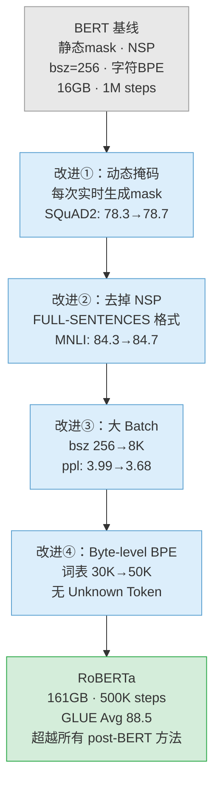

# RoBERTa

> 对应论文：`paper/RoBERTa-Robustly-Optimized-BERT-Pretraining.pdf`（Liu et al., 2019）
> 论文链接：https://arxiv.org/abs/1907.11692
>
> 核心结论：BERT 被严重欠训练——不改模型架构，只改训练策略，就能显著超越所有后 BERT 时代的方法。

---

## 1. 背景：BERT 真的到天花板了吗？

读完 BERT.md，你已经知道 BERT 的两大预训练目标（MLM + NSP）以及它双向 Attention 的架构设计。BERT 发布后，NLP 社区迅速出现了大量"改进版"——XLNet、ALBERT、SpanBERT……它们各自在架构上做出改动，都声称超越了 BERT。

但 Facebook AI Research 的研究者们提出了一个不同的问题：

**这些模型真的比 BERT 好，还是只是因为 BERT 训练时间太短、数据太少、超参数不够优？**

Liu et al. 用近千个 GPU 小时对这个问题做了系统性实验。结论出人意料：**BERT 被显著欠训练（undertrained）**。只要优化训练策略——训练更久、用更多数据、调整几个关键设计——不修改任何模型架构，就能超越所有当时的 post-BERT 方法。

他们把这个经过鲁棒优化的训练方案命名为 **RoBERTa**（**Ro**bustly **o**ptimized **BERT** **p**retraining **a**pproach）。

### 1.1 BERT 的原始训练配置（基线）

作为参照，先看 BERT 原始训练设置（论文 Section 2.2）：

| 配置项 | BERT-Base | BERT-Large |
|:---|:---|:---|
| 层数 $L$ / 隐藏维度 $H$ / 注意力头数 $A$ | 12 / 768 / 12 | 24 / 1024 / 16 |
| 参数量 | 110M | 340M |
| Batch size | 256 | 256 |
| 训练步数 | 1M steps | 1M steps |
| 序列长度上限 | 512 | 512 |
| 学习率（Adam） | $1 \times 10^{-4}$ | $1 \times 10^{-4}$ |
| 预热步数（warmup） | 10K steps | 10K steps |
| 训练数据 | BookCorpus + Wikipedia ≈ 16GB | 同左 |

这些参数就是 RoBERTa 论文要逐一审视和改进的起点。

---

## 2. 四个改进：从消融实验看每一步带来什么

RoBERTa 对 BERT 的训练策略做了 4 个关键改动，每个都有配套**消融实验（ablation study）**。下面逐一拆解。

### 2.1 动态掩码 vs 静态掩码（Section 4.1，Table 1）

**为什么要改掩码策略？**

BERT 使用的是**静态掩码（static masking）**：在数据预处理阶段，就把每个样本的 mask 模式固定下来。为了让有限的数据尽量多样，BERT 把训练语料复制 10 份，每份生成不同的 mask，然后训练 40 个 epoch——平均下来，每种 mask 模式会被模型看到 4 次。

可以把静态掩码想象成一道做了 4 遍的练习题：题目没变，只是做了几次，很快就"背答案"了。

**动态掩码（dynamic masking）** 的做法则是：每次把一个样本送给模型时，**实时生成**本次的 mask 模式。这样模型每次看到同一句话，遮盖的是不同的位置，每次都是"新题目"。

论文 Table 1 给出了消融结果（相同训练数据量下）：

| 方法 | SQuAD 2.0 | MNLI-m | SST-2 |
|:---|:---:|:---:|:---:|
| 静态掩码（BERT 原版） | 78.3 | 84.3 | 92.5 |
| **动态掩码（RoBERTa）** | **78.7** | 84.0 | **92.9** |

动态掩码在多数任务上相当甚至略有提升，而且实现成本极低——只需把预处理时的 mask 生成移到训练循环里。RoBERTa 采用动态掩码。

两种掩码策略的实现对比：

```python
import random
import torch

MASK_ID = 103   # [MASK] 对应的 token id（BERT 词表中的位置）
vocab_size = 50265  # RoBERTa 词表大小

# -------- 静态掩码（BERT 原始做法）--------
# 在数据预处理阶段一次性生成 mask，结果固定存储到磁盘
def preprocess_static(tokens, mask_prob=0.15, seed=42):
    random.seed(seed)          # seed 固定 → 同一条数据每次 mask 方案完全相同
    masked_tokens = tokens[:]
    labels = [-100] * len(tokens)  # -100 表示不参与 loss 计算
    for i, token in enumerate(tokens):
        if random.random() < mask_prob:
            labels[i] = token          # 保存原始 token 作为预测目标
            masked_tokens[i] = MASK_ID # 替换为 [MASK]
    return masked_tokens, labels       # 训练时反复使用同一份结果


# -------- 动态掩码（RoBERTa 做法）--------
# 不预处理，每次前向传播前实时生成不同的 mask
def apply_dynamic_mask(tokens: torch.Tensor, mask_prob=0.15):
    masked_tokens = tokens.clone()
    labels = torch.full_like(tokens, -100)   # 初始化为全 -100（不计入 loss）

    # 随机选取约 mask_prob 比例的位置
    prob_matrix = torch.full(tokens.shape, mask_prob)
    selected = torch.bernoulli(prob_matrix).bool()

    labels[selected] = tokens[selected]  # 记录原始 token 作为预测目标

    # 被选中的 80% 替换为 [MASK]，10% 替换随机词，10% 保持不变
    rand = torch.rand_like(tokens.float())
    mask_indices   = selected & (rand < 0.80)
    random_indices = selected & (rand >= 0.80) & (rand < 0.90)
    # rand >= 0.90 的位置保持不变，不需要额外处理

    masked_tokens[mask_indices] = MASK_ID
    masked_tokens[random_indices] = torch.randint(
        vocab_size, tokens[random_indices].shape
    )

    return masked_tokens, labels   # 每次调用结果都不同：同一句话，不同 mask 方案
```

---

### 2.2 去掉 NSP + 调整输入格式（Section 4.2，Table 2）

**为什么怀疑 NSP？**

BERT 的第二个预训练目标是 **NSP（Next Sentence Prediction）**：把两个句子拼接，让模型判断第二句是否紧随第一句出现。原论文认为这能帮助模型理解句间关系。

RoBERTa 的研究者对这个假设产生了怀疑：NSP 的负样本来自**不同文档**随机采样，主题差距往往一目了然——模型不需要理解语言，只需"感受到话题不一致"就能答对。NSP 可能学到的是"话题匹配"而非真正的"语篇连贯"。

**实验了 4 种输入格式（Table 2）**：

| 输入格式 | NSP | 说明 |
|:---|:---:|:---|
| SEGMENT-PAIR + NSP | 有 | BERT 原始设置：两个完整句段拼接 |
| SENTENCE-PAIR + NSP | 有 | 两个单条自然句，序列很短 |
| FULL-SENTENCES | **无** | 跨文档连续采样，填满 512 token |
| DOC-SENTENCES | **无** | 同文档连续采样，不跨文档边界 |

Table 2 的实验结果：

| 格式 | SQuAD 1.1 | SQuAD 2.0 | MNLI-m | RACE |
|:---|:---:|:---:|:---:|:---:|
| SEGMENT-PAIR + NSP | 90.4 | 78.7 | 84.0 | 64.9 |
| SENTENCE-PAIR + NSP | 88.7 | 76.2 | 83.9 | 63.5 |
| FULL-SENTENCES | 90.4 | 79.1 | 84.7 | 65.5 |
| **DOC-SENTENCES** | **90.6** | **79.7** | **84.7** | **65.6** |

结论：

1. **去掉 NSP 能匹配或提升性能**：FULL-SENTENCES 和 DOC-SENTENCES 都优于带 NSP 的设置。
2. **单条自然句（SENTENCE-PAIR）会损害性能**：序列太短，无法建模长距离依赖。
3. **DOC-SENTENCES 略优**，但靠近文档末尾时 batch 长度会缩短，导致每批次 token 数不均匀，实现麻烦。

最终 **RoBERTa 采用 FULL-SENTENCES，不使用 NSP loss**。

---

### 2.3 大 Batch 训练（Section 4.3，Table 3）

**为什么大 batch 有帮助？**

可以把训练过程想象成在山坡上找最低点：每次梯度更新用的样本越多，对"真实坡度"的估计就越准，方向越稳。大 batch 因此允许更高的学习率，同时天然适合分布式多卡并行训练。

论文用**困惑度（perplexity，ppl）**和 MNLI-m 准确率来比较不同 batch size（固定总 token 数量，Table 3）：

| batch size | 步数 | 学习率 | 困惑度（越低越好） | MNLI-m |
|:---:|:---:|:---:|:---:|:---:|
| 256 | 1M steps | $1 \times 10^{-4}$ | 3.99 | 84.7 |
| **2K** | 125K steps | $7 \times 10^{-4}$ | **3.68** | **85.2** |
| 8K | 31K steps | $1 \times 10^{-3}$ | 3.77 | 84.6 |

batch size=2K 时困惑度最低，下游任务最优。batch size=8K 困惑度略有回升，但考虑到训练效率和后续扩大数据规模的需求，**RoBERTa 最终选择 batch size=8K**——这样每步处理的 token 数更多，总训练 token 量远超 BERT。

注意：batch size 增大时，学习率也需要同步上调。论文里 batch size 从 256 → 8K 放大了 32 倍，学习率从 $1 \times 10^{-4}$ 提升到 $1 \times 10^{-3}$：

$$
\text{新学习率} \approx \text{原学习率} \times \sqrt{\frac{\text{新 batch size}}{\text{原 batch size}}}
$$

这来自梯度方差分析：batch 扩大 $k$ 倍，梯度的标准差缩小 $\sqrt{k}$ 倍，学习率可以相应放大 $\sqrt{k}$ 倍而不失稳定性。

---

### 2.4 Byte-Level BPE Tokenizer（Section 4.4）

**两种 BPE 的区别**

**BPE（Byte Pair Encoding）** 是一种常用的子词分词算法：把频繁出现的字符组合合并为一个词元，直到达到预设词表大小。

BERT 使用**字符级 BPE**（WordPiece）：以 Unicode 字符为基本单位，词表约 30K。缺点：遇到词表外的字符（罕见文字、表情符号、代码等），只能用 `[UNK]` 替代，信息丢失。

RoBERTa 改用 **Byte-level BPE**（由 GPT-2 引入）：以**字节（byte）**为最小单位——任何文本在计算机里都是字节序列，因此可以编码任意 Unicode 字符，**不会产生 unknown token**。词表扩展到 50K。

| 对比项 | 字符级 BPE（BERT） | Byte-level BPE（RoBERTa） |
|:---|:---:|:---:|
| 最小单位 | Unicode 字符 | 字节（byte） |
| 词表大小 | ~30K | ~50K |
| Unknown token | 有 | **没有** |
| 字符/语言覆盖 | 受限 | **任意文本** |
| 某些任务性能 | 略高 | 轻微下降（~1%） |

在某些下游任务上有约 1% 的性能微降，但论文认为通用性带来的收益值得。**RoBERTa 采用 byte-level BPE。**

两种 tokenizer 的行为差异：

```python
from transformers import BertTokenizer, RobertaTokenizer

# -------- BERT：字符级 BPE（WordPiece）--------
bert_tok = BertTokenizer.from_pretrained("bert-base-uncased")
tokens = bert_tok.tokenize("RoBERTa uses byte-level BPE!")
# 示例输出: ['ro', '##bert', '##a', 'uses', 'byte', '-', 'level', 'bp', '##e', '!']
# 词表 ~30K，遇到 emoji 或罕见字符可能输出 [UNK]

# -------- RoBERTa：Byte-level BPE（GPT-2 风格）--------
roberta_tok = RobertaTokenizer.from_pretrained("roberta-base")
tokens = roberta_tok.tokenize("RoBERTa uses byte-level BPE!")
# 示例输出: ['Rob', 'ER', 'Ta', 'Ġuses', 'Ġbyte', '-', 'level', 'ĠBPE', '!']
# 词表 50K，'Ġ' 表示该子词前面有空格；任意 Unicode 字符均可表示，无 [UNK]
```

---

## 3. 训练数据：从 16GB 到 160GB+

改进训练策略的同时，RoBERTa 也大幅扩展了训练数据（Section 3.2）。

BERT 只用了 BookCorpus + Wikipedia（约 16GB），RoBERTa 加入了三个更大的语料库：

| 数据集 | 大小 | 说明 |
|:---|:---:|:---|
| BookCorpus + Wikipedia | 16GB | BERT 原始数据 |
| **CC-News** | **76GB** | CommonCrawl 新闻，2016—2019 年，6300 万篇英语文章 |
| **OpenWebText** | **38GB** | Reddit 高赞链接对应的网页正文，质量较高 |
| **Stories** | **31GB** | CommonCrawl 故事风格子集 |
| **合计** | **~161GB** | |

数据量的增加是独立的改进变量——RoBERTa 通过消融实验（Table 4）分别验证了数据量和训练步数各自带来的增益，而不是把它们混在一起声称整体提升。

---

## 4. 累积效果：每一步改进带来多少（Table 4）

论文用 BERT-Large 架构（$L=24, H=1024, A=16$），把上述改进**逐步叠加**，测量每步对 SQuAD 和 GLUE 的影响：

| 配置 | SQuAD 1.1 | SQuAD 2.0 | MNLI-m | SST-2 |
|:---|:---:|:---:|:---:|:---:|
| 动态掩码 + FULL-SENT + bsz 8K，16GB，100K steps | 93.6 | 87.3 | 89.0 | 95.3 |
| + 160GB 数据 | 94.0 | 87.7 | 89.3 | 95.6 |
| + 300K steps | 94.4 | 88.7 | 90.0 | 96.1 |
| **+ 500K steps（最终 RoBERTa）** | **94.6** | **89.4** | **90.2** | **96.4** |

逐步解读：

- **数据量** 从 16GB → 160GB：SQuAD 1.1 提升 0.4，MNLI 提升 0.3
- **训练步数** 从 100K → 300K：MNLI 再提升 0.7，SQuAD 2.0 提升 1.0
- **步数** 从 300K → 500K：继续稳定提升，边际递减但仍有收益

**更多数据、更长训练，一直都有帮助。BERT 确实被欠训练了。**

---

## 5. GLUE 排行榜结果（Table 5）

最终 RoBERTa 在 GLUE 测试集排行榜上的成绩：

| 模型 | MNLI-m/mm | QNLI | QQP | RTE | SST-2 | MRPC | CoLA | STS-B | **Avg** |
|:---|:---:|:---:|:---:|:---:|:---:|:---:|:---:|:---:|:---:|
| BERT-Large | 86.6 / — | 92.3 | 87.6 | 70.4 | 93.2 | 88.0 | 60.5 | 90.0 | ~80 |
| XLNet-Large | 89.8 / — | 98.6 | 90.3 | 86.3 | 95.6 | 93.0 | 67.8 | 91.6 | 88.4 |
| **RoBERTa** | **90.2 / 90.2** | **98.9** | **90.2** | **88.2** | **96.7** | **92.3** | **67.8** | **92.2** | **88.5** |

RoBERTa 以 88.5 的平均分超过 XLNet 的 88.4，成为当时 GLUE 榜首——而它没有改变任何模型架构，只是把训练做得更充分。

---

## 6. 四个改进的流程图



---

## 7. 完整对比表

| 改进项 | BERT 原设置 | RoBERTa 设置 | 主要效果 |
|:---|:---|:---|:---|
| 掩码策略 | 静态掩码，预处理固定，复制 10 份 | 动态掩码，每次前向传播实时生成 | 训练多样性↑，性能相当或略好 |
| 输入格式 / NSP | SEGMENT-PAIR + NSP loss | FULL-SENTENCES，**无 NSP** | MNLI +0.4，SQuAD2 +1.0 |
| Batch size | 256，lr=$1\!\times\!10^{-4}$ | 8K，lr=$1\!\times\!10^{-3}$ | ppl 3.99→3.68，MNLI +0.5 |
| Tokenizer | 字符级 BPE（WordPiece），词表 30K | Byte-level BPE，词表 50K | 零 unknown token，覆盖任意字符 |
| 训练数据 | 16GB（Books + Wiki） | ~161GB（+CC-News / OWT / Stories） | MNLI +0.3，SQuAD1.1 +0.4 |
| 训练步数 | 1M steps（≈131B tokens） | 500K steps（≈2T tokens，大 bsz） | 每步更多 token，总计算量远超 BERT |

---

## 8. 常见混淆问题

**Q：RoBERTa 是一个全新的模型架构吗？**

不是。RoBERTa 的 Transformer 架构与 BERT-Large 完全相同（24 层，1024 维，16 头），唯一变化是词表从 30K 扩展到 50K（换了 Byte-level BPE）。它的贡献是训练方法，不是架构创新。

**Q：去掉 NSP 后，模型还能理解两个句子之间的关系吗？**

可以。NSP 去掉的只是一个辅助的二分类训练信号。模型仍然通过 MLM 在全双向 Attention 下看到拼接的文本段，依然可以学到句间关系。实验结果也证实了去掉 NSP 反而更好——NSP 原本学到的是"话题一致性"而非真正的句间关系。

**Q：动态掩码和静态掩码效果差很多吗？**

差异不大（Table 1 约 0.3–0.4 个点之内），但动态掩码实现简单、理论更合理，所以 RoBERTa 采用了它。

**Q：Byte-level BPE 一定比字符级 BPE 好吗？**

不一定。论文承认在某些任务上有约 1% 的性能微降。Byte-level BPE 的主要优势是通用性（零 unknown token，覆盖任意语言和字符），对多语言场景尤其重要。

**Q：为什么 BERT 训练 1M steps，RoBERTa 只用 500K steps 效果更好？**

因为 RoBERTa 的 batch size 是 BERT 的 32 倍（8K vs 256）。500K steps × bsz 8K ≈ 2T tokens，BERT 1M steps × bsz 256 ≈ 131B tokens。**步数少但每步处理的 token 数多得多**，总计算量反而远超原始 BERT。

**Q：RoBERTa 在现在还值得学习吗？大模型已经远超它了。**

值得，理由有两个。第一，Encoder-Only 模型在文本理解、检索、分类任务上的推理效率远高于 Decoder-Only 的大模型，在很多生产场景中仍是主力。第二，RoBERTa 揭示的"训练配方与架构同等重要"这一洞察，对理解后续所有大模型的训练设计都有帮助——ELECTRA、DeBERTa 等后续工作都以 RoBERTa 的训练配方作为起点。

---

## 9. 读完这篇之后，你应该能回答这些问题

- RoBERTa 改变了 BERT 的哪些地方？哪些地方**没有**改变？
- 动态掩码和静态掩码的区别是什么？为什么动态掩码理论上更合理？
- 论文为什么去掉 NSP？去掉之后通过什么实验数据来支撑这个结论（Table 2 的 4 种格式分别是什么）？
- FULL-SENTENCES 和 DOC-SENTENCES 各是什么格式？最终为什么选 FULL-SENTENCES 而不是效果更好的 DOC-SENTENCES？
- 为什么 batch size=2K 时困惑度最低，但 RoBERTa 最终选 batch size=8K？
- Byte-level BPE 和字符级 BPE 的核心区别是什么？为什么 Byte-level BPE 不会产生 unknown token？
- RoBERTa 用 500K steps、bsz=8K 训练，实际消耗的 token 数量大约是 BERT 的多少倍？
- Table 4 的消融实验显示，在 RoBERTa 的提升里，数据量和训练步数各自贡献了多少？

---

## 参考资料

- RoBERTa 论文：`paper/RoBERTa-Robustly-Optimized-BERT-Pretraining.pdf`
- 论文链接：https://arxiv.org/abs/1907.11692
- BERT 论文：https://arxiv.org/abs/1810.04805
- Hugging Face RoBERTa 模型卡：https://huggingface.co/roberta-base
- WiA 项目 BERT.md：`Attention/BERT.md`
