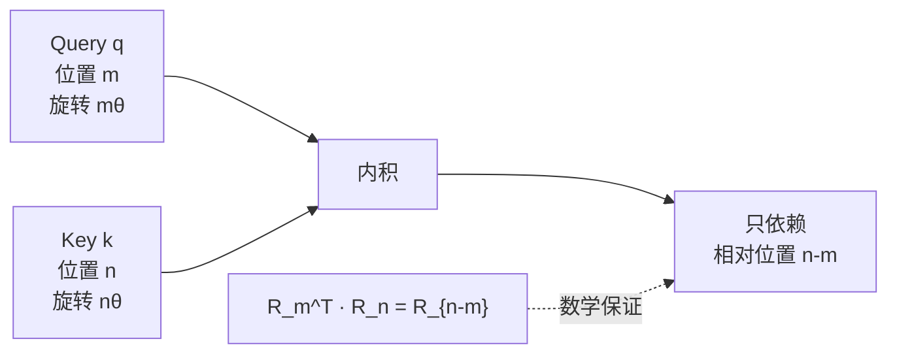

# RoPE：旋转位置编码

> 对应论文：`paper/RoPE-RoFormer-Rotary-Position-Embedding.pdf`
> RoFormer: Enhanced Transformer with Rotary Position Embedding，Su et al.，2021
> https://arxiv.org/abs/2104.09864

---

## 1. 背景：位置编码的根本矛盾

读完 Transformer 那篇，你知道 Attention 机制本身是**位置无感知的**：对调序列中任意两个 token 的顺序，如果不加位置编码，模型的输出不会变化。所以必须想办法把位置信息注入进来。

原始 Transformer 的方案是**绝对位置编码**：在词嵌入送入模型之前，把一个和位置有关的向量 $\boldsymbol{p}_m$ 加进去：

$$
f_{q,k,v}(\boldsymbol{x}_m, m) := \boldsymbol{W}_{q,k,v}(\boldsymbol{x}_m + \boldsymbol{p}_m) \tag{论文式3}
$$

这个方案能用，但有一个根本性的问题：**位置信息是在注意力计算之前加进去的，之后它与内容信息混在一起，进入点积时两者会相互干扰**。

更重要的是，注意力分数从语言建模的角度来看，应该主要由 **相对位置** 决定：位置 $m$ 的词和位置 $n$ 的词之间的关联，更多取决于它们相距多远（$m - n$），而不是它们各自的绝对位置是多少。"我"和"打"之间的关系，不该因为它们是出现在句子开头还是中间而有所不同。

论文把这个需求写成一个严格的数学目标（论文式11）：

$$
\langle f_q(\boldsymbol{x}_m, m),\; f_k(\boldsymbol{x}_n, n) \rangle = g(\boldsymbol{x}_m, \boldsymbol{x}_n, m - n) \tag{11}
$$

要找一种编码函数 $f_q$ 和 $f_k$，使得它们的内积**只依赖相对位置** $m - n$，而不是绝对位置 $m$ 和 $n$。

**RoPE（Rotary Position Embedding，旋转位置编码）** 就是满足上述要求的一个优雅解。

---

## 2. 核心思想：用旋转编码相对位置

### 2.1 从钟表类比出发

想象两根指针，分别在角度 $m\theta$ 和 $n\theta$ 的位置。不管它们各自的绝对角度是多少，它们之间的**夹角**永远是 $(m - n)\theta$——只跟相对位置有关，和绝对位置无关。

RoPE 正是利用这个几何性质：对 Query 和 Key 向量分别施加一个旋转，旋转角度由各自的位置决定。这样，两个旋转后向量的点积，自然只依赖两者旋转角度之差，也就是相对位置。

### 2.2 二维情况的推导

论文从最简单的 $d = 2$ 出发（论文 Section 3.2.1）。

把 Query 和 Key 看成二维平面上的向量，对位置 $m$ 处的 Query 向量施加旋转矩阵 $R_m$：

$$
f_q(\boldsymbol{x}_m, m) = \underbrace{\begin{pmatrix} \cos m\theta & -\sin m\theta \\ \sin m\theta & \cos m\theta \end{pmatrix}}_{R_m} \boldsymbol{W}_q \boldsymbol{x}_m \tag{论文式13}
$$

对 Key 向量同理，施加旋转角 $n\theta$。

现在计算两者的内积：

$$
\langle f_q(\boldsymbol{x}_m, m),\ f_k(\boldsymbol{x}_n, n) \rangle = (\boldsymbol{W}_q \boldsymbol{x}_m)^\top R_m^\top R_n (\boldsymbol{W}_k \boldsymbol{x}_n)
$$

注意到 $R_m^\top R_n = R_{n-m}$（旋转矩阵的转置等于逆旋转，两个旋转的组合等于角度相减的旋转），所以：

$$
= (\boldsymbol{W}_q \boldsymbol{x}_m)^\top R_{n-m} (\boldsymbol{W}_k \boldsymbol{x}_n)
$$

这个内积**只依赖相对位置** $n - m$，严格满足论文目标式（11）。推导完毕。



### 2.3 推广到 $d$ 维：块对角旋转矩阵

对于 $d$ 维的 Query/Key 向量（$d$ 为偶数），将向量**两两配对**，分成 $d/2$ 个二维子空间，每个子空间用不同频率 $\theta_i$ 做旋转（论文式14、15）：

$$
\theta_i = 10000^{-2(i-1)/d}, \quad i = 1, 2, \ldots, \frac{d}{2}
$$

整体的旋转矩阵 $\boldsymbol{R}^d_{\Theta, m}$ 是一个**块对角矩阵**，每个 $2 \times 2$ 的对角块对应一对维度：

$$
\boldsymbol{R}^d_{\Theta, m} = \begin{pmatrix}
\cos m\theta_1 & -\sin m\theta_1 & & & \\
\sin m\theta_1 & \cos m\theta_1 & & & \\
& & \cos m\theta_2 & -\sin m\theta_2 & \\
& & \sin m\theta_2 & \cos m\theta_2 & \\
& & & & \ddots
\end{pmatrix} \tag{15}
$$

将 RoPE 应用到注意力公式后（论文式16），注意力分数变为：

$$
\boldsymbol{q}_m^\top \boldsymbol{k}_n = \boldsymbol{x}_m^\top \boldsymbol{W}_q\, \boldsymbol{R}^d_{\Theta,\,n-m}\, \boldsymbol{W}_k \boldsymbol{x}_n \tag{16}
$$

只依赖 $n - m$，严格满足相对位置要求。

---

## 3. 高效实现：不显式构造旋转矩阵

$\boldsymbol{R}^d_{\Theta, m}$ 是一个 $d \times d$ 的大矩阵，但它极度稀疏——实际上没必要真的去构造和乘这个矩阵。

论文给出了等价的逐元素计算公式（论文式34）。把向量 $\boldsymbol{x} = (x_1, x_2, x_3, x_4, \ldots, x_{d-1}, x_d)$ 按相邻两维配对，做一个"翻转负号"操作得到：

$$
\boldsymbol{x}_{\text{rot}} = (-x_2,\ x_1,\ -x_4,\ x_3,\ \ldots,\ -x_d,\ x_{d-1})
$$

则旋转等价于：

$$
\boldsymbol{R}^d_{\Theta, m}\, \boldsymbol{x} = \boldsymbol{x} \otimes \cos(m\Theta) + \boldsymbol{x}_{\text{rot}} \otimes \sin(m\Theta) \tag{34}
$$

其中 $\Theta = (\theta_1, \theta_1, \theta_2, \theta_2, \ldots, \theta_{d/2}, \theta_{d/2})$（每个频率重复两次，分别对应同一对维度），$\otimes$ 表示逐元素乘。

这个形式只需要**三次逐元素操作**（一次 rotate，两次乘加），完全不需要矩阵乘法，在 GPU 上效率极高。

---

## 4. 代码实现

下面是 PyTorch 风格的完整实现，分三部分：预计算缓存、施加旋转、在 Attention 中调用。

```python
import torch
import math

def precompute_rope_cache(seq_len, head_dim, base=10000, device='cpu'):
    """
    预计算所有位置的 cos 和 sin 值，避免推理时重复计算。
    head_dim: 每个注意力头的维度 d
    base: 频率底数，默认 10000（LLaMA 3 用 500000）
    """
    # 计算每对维度的频率 θ_i = base^{-2(i-1)/d}，共 d/2 个频率
    i = torch.arange(0, head_dim // 2, dtype=torch.float32, device=device)
    theta = 1.0 / (base ** (2 * i / head_dim))   # (head_dim/2,)

    # 为每个位置计算旋转角：pos × θ_i
    positions = torch.arange(seq_len, dtype=torch.float32, device=device)
    angles = torch.outer(positions, theta)         # (seq_len, head_dim/2)

    # 每个频率重复两次，对应同一对维度的两个分量
    angles = torch.cat([angles, angles], dim=-1)   # (seq_len, head_dim)
    return angles.cos(), angles.sin()              # 各 (seq_len, head_dim)


def apply_rope(x, cos, sin):
    """
    对 Query 或 Key 向量施加 RoPE 旋转。
    x:   (batch, n_heads, seq_len, head_dim)
    cos: (seq_len, head_dim)
    sin: (seq_len, head_dim)
    """
    head_dim = x.shape[-1]

    # 构造 x_rot：相邻两个维度交换并取负，实现旋转中的"垂直分量"
    # (x_1, x_2, x_3, x_4, ...) → (-x_2, x_1, -x_4, x_3, ...)
    x1 = x[..., : head_dim // 2]        # 偶数维度：x_1, x_3, x_5, ...
    x2 = x[..., head_dim // 2 :]        # 奇数维度：x_2, x_4, x_6, ...
    x_rot = torch.cat([-x2, x1], dim=-1)  # 组合成 x_rot

    # 施加旋转：x·cos + x_rot·sin（对应论文式 34）
    # cos/sin 形状 (seq_len, head_dim)，广播到 (batch, heads, seq_len, head_dim)
    return x * cos + x_rot * sin


def attention_with_rope(q, k, v, cos, sin, mask=None):
    """
    带 RoPE 的标准 Scaled Dot-Product Attention。
    q, k, v: (batch, n_heads, seq_len, head_dim)
    """
    head_dim = q.shape[-1]

    # 只对 Q 和 K 施加 RoPE，V 不旋转（旋转只影响"注意哪里"，不影响"读什么"）
    q = apply_rope(q, cos, sin)
    k = apply_rope(k, cos, sin)

    # 标准注意力计算，此时 QK 内积已隐含相对位置信息
    scores = (q @ k.transpose(-2, -1)) / math.sqrt(head_dim)
    if mask is not None:
        scores = scores + mask
    weights = scores.softmax(dim=-1)
    return weights @ v
```

使用示例：

```python
batch, n_heads, seq_len, head_dim = 2, 8, 1024, 64

# 一次预计算，反复使用
cos_cache, sin_cache = precompute_rope_cache(seq_len, head_dim)

q = torch.randn(batch, n_heads, seq_len, head_dim)
k = torch.randn(batch, n_heads, seq_len, head_dim)
v = torch.randn(batch, n_heads, seq_len, head_dim)

out = attention_with_rope(q, k, v, cos_cache, sin_cache)
```

---

## 5. RoPE 的三个核心性质

### 5.1 相对位置依赖（数学严格保证）

注意力分数 $\boldsymbol{q}_m^\top \boldsymbol{k}_n = \boldsymbol{x}_m^\top \boldsymbol{W}_q \boldsymbol{R}^d_{\Theta,\,n-m} \boldsymbol{W}_k \boldsymbol{x}_n$，严格只依赖 $n-m$，不含绝对位置 $m$ 或 $n$ 的单独信息。这是 RoPE 相比加法式绝对位置编码的根本优势。

### 5.2 长程衰减（归纳偏置）

论文 Section 3.4.3 证明：RoPE 注意力分数的绝对值上界随相对距离 $|m - n|$ 增大而**单调衰减**（论文式35–37，Figure 2）。

直觉：频率较高的旋转维度（小 $i$ 对应大 $\theta_i$）旋转很快，距离远的两个 token 在这些维度上的方向相差很大，点积趋近于零；频率较低的维度旋转慢，保持长程关系。整体上，距离越远的 token 对，相关性越低。

这和语言直觉吻合：相邻的词通常比相距很远的词更相关。

### 5.3 不施加于 Value（只改变"注意哪里"）

旋转只对 Q 和 K 施加，V 完全不动。这是有意设计的：

| 组件 | 作用 | RoPE 的影响 |
|:---|:---|:---|
| Q、K | 决定"注意力分布在哪里" | ✅ 旋转，注入相对位置信息 |
| V | 决定"读取什么内容" | ❌ 不旋转，内容纯粹 |

对 V 施加旋转会把位置信息混入内容表示，反而造成干扰。

---

## 6. 与其他位置编码方案的对比

| 方法 | 注入方式 | 建模关系 | 长度外推 | 代表模型 |
|:---|:---|:---|:---|:---|
| 正弦余弦 PE | 加到词嵌入 | 绝对位置 | 差 | 原始 Transformer |
| 可学习绝对 PE | 加到词嵌入 | 绝对位置 | 差（训练长度外急剧退化） | GPT-2、BERT |
| ALiBi | 给注意力分数减线性偏置 | 相对位置 | 较好 | BLOOM、MPT |
| **RoPE** | **旋转 Q 和 K** | **相对位置（数学严格）** | **较好** | **LLaMA、Qwen、Gemma、Mistral……** |

RoPE 目前已成为开源大模型中**事实上的标准位置编码**，几乎所有 2023 年后的主流模型都在使用。

---

## 7. 频率底数与长上下文扩展

### 7.1 底数的直觉

频率公式 $\theta_i = \text{base}^{-2(i-1)/d}$，不同的 $i$ 对应不同的旋转速度：
- 小 $i$（前几对维度）：$\theta_i$ 大，旋转快，编码**短程**位置关系
- 大 $i$（后几对维度）：$\theta_i$ 小，旋转慢，编码**长程**位置关系

直觉：就像一块钟表，秒针转得快（感知短时间），分针和时针转得慢（感知长时间）。

### 7.2 base 越大，能"看得更远"

对最低频的维度，两个 token 旋转角度之差为 $(m-n) \cdot \text{base}^{-1}$。base 越大，这个角度越小，意味着在更大的相对距离内，方向变化仍然很小，模型仍能区分不同的相对位置。

| 模型 | base 值 | 支持上下文 |
|:---|:---:|:---:|
| LLaMA 1/2 | 10000 | 2K / 4K |
| LLaMA 3 | 500000 | 128K |
| Qwen2.5 | 1000000 | 128K |

### 7.3 其他长上下文扩展方案（简介）

- **YaRN**：对不同频率维度采用不同的缩放策略，低频维度拉伸更少
- **LongRoPE**：在推理时动态调整 base，不需要重新训练
- **NTK-aware scaling**：根据上下文长度等比例缩放 base

这些扩展方案的共同目标是：让模型在**不重新训练**或**少量微调**的情况下，推理时处理比训练时更长的序列。

---

## 8. 初学者常见混淆

**Q：RoPE 是加到词嵌入上的，还是加到 Q/K 上的？**

加到 Q 和 K 上，更准确说是"乘到"——旋转操作是矩阵乘法，不是加法。绝对位置编码是加法式（加到词嵌入），RoPE 是乘法式（施加旋转矩阵）。两者的注入时机和位置都不同。

**Q：apply_rope 里为什么要把 head_dim 拆成前后两半，而不是奇偶交错？**

这是一种等价的实现方式，PyTorch 实现中两种都有。把前一半和后一半分开（LLaMA 的做法）和奇偶交错拆分（原始论文的写法）数学上完全等价，只是维度排列方式不同。两种实现都正确，只需确保 Q 和 K 使用同一种拆分方式。

**Q：为什么不对 V 施加 RoPE？**

旋转的目的是让注意力分数（Q·K 内积）感知相对位置。V 是"值"，是最终要聚合的内容，不需要也不应该携带位置信息。对 V 旋转会把位置信息混入输出的内容表示，引入不必要的偏差。

**Q：RoPE 的长度外推为什么有限制？**

RoPE 的外推能力并非无限。高频维度（短程）的旋转角度在训练上下文内已经转了很多圈，推理时如果超出训练长度，高频维度的旋转角度会进入"未见过的区域"，模型性能会下降。调大 base（如 LLaMA 3 的 500000）可以让高频维度转得更慢，从而延缓这个退化，但不能完全消除。

---

## 9. 读完这篇之后，你应该能回答这些问题

- 为什么绝对位置编码不能让注意力分数"只依赖相对位置"？这在数学上有什么问题？
- RoPE 的核心操作是什么？旋转角度如何由位置索引 $m$ 和频率 $\theta_i$ 决定？
- 二维情况下，为什么 $(R_m q)^\top (R_n k)$ 只依赖 $n-m$？用 $R_m^\top R_n = R_{n-m}$ 推导一遍。
- $d$ 维情况下，RoPE 的旋转矩阵 $R^d_{\Theta,m}$ 是什么结构？它的高效实现是什么公式？
- `apply_rope` 函数里的 `x_rot` 是怎么构造的？为什么这样构造等价于旋转矩阵乘法？
- 为什么 RoPE 只对 Q 和 K 施加，不对 V 施加？
- RoPE 的"长程衰减"性质是什么？为什么说这是一个好的归纳偏置？
- LLaMA 3 把 base 从 10000 提升到 500000 是为了什么？调大 base 对不同频率维度的影响有何不同？

---

## 参考资料

- 原始论文：`paper/RoPE-RoFormer-Rotary-Position-Embedding.pdf`
- https://arxiv.org/abs/2104.09864
- 在 LLaMA 中的应用：见本项目 [`LLaMA.md`](LLaMA.md)
- ALiBi（另一种相对位置编码方案）：`paper/ALiBi-Attention-with-Linear-Biases.pdf`
