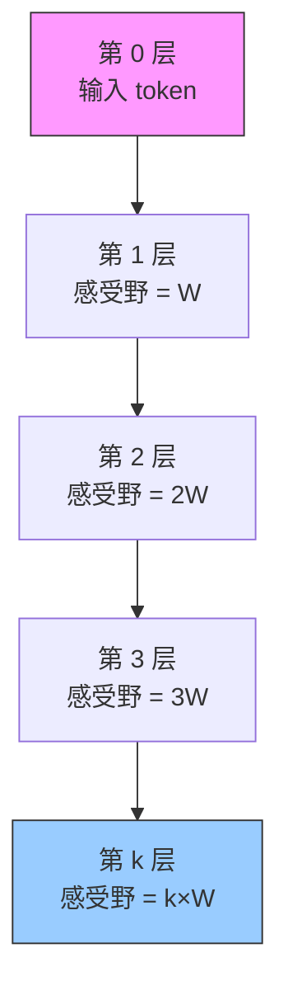

# Sliding Window Attention（SWA）

> 对应论文：`paper/Mistral-Mistral-7B.pdf`（Jiang et al., 2023）
> 参考文献：Longformer（Beltagy et al., 2020，arXiv:2004.08249）
>
> 标准因果注意力在长序列上有两个硬伤：计算量随序列长度平方增长，以及 KV Cache 随生成无限膨胀。SWA 用"每层只看附近 W 个 token、多层叠加传播信息"的思路，同时解决这两个问题。

---

## 1. 背景：标准因果注意力的两个痛点

### 1.1 问题一：O(N²) 的计算量

在标准的因果注意力（Causal Attention）里，生成第 $t$ 个 token 时，模型需要把当前 token 的 Query 与前面所有 $t-1$ 个 token 的 Key 做点积，再对所有 Value 加权求和。

把整个序列的计算量加起来：序列长度为 $N$ 时，总操作数正比于：

$$
\sum_{t=1}^{N} t \approx \frac{N^2}{2} \quad \Rightarrow \quad O(N^2)
$$

这意味着：序列长度翻倍，计算量变为原来的四倍。当序列超过 8K、16K 甚至 32K token 时，计算代价急剧膨胀。

### 1.2 问题二：KV Cache 的内存压力

在推理阶段，为了避免重复计算历史 token 的 Key 和 Value，模型会把它们缓存下来，称为 **KV Cache**。

标准 KV Cache 的大小：

$$
\text{KV Cache 大小} = 2 \times N \times n\_\text{layers} \times n\_\text{heads} \times \text{head\_dim}
$$

其中系数 2 对应 K 和 V 两个矩阵。每生成一个新 token，缓存就增长一格，且永远不会减小。对于 Mistral 7B 的配置（32 层、8 个 KV 头、head_dim=128），序列长度 32K 时，KV Cache 会占用数 GB 显存——这在实际部署中是严重的瓶颈。

### 1.3 核心矛盾

两个问题其实指向同一个根源：**标准注意力要求每个 token 直接访问所有历史 token**。这种"全局直连"的设计在短序列上没问题，但在长序列下代价过高。

能不能让每个 token 只看一个局部窗口，同时又不丢失远距离的信息？**Sliding Window Attention（滑动窗口注意力，SWA）** 给出了一个优雅的答案。

---

## 2. SWA 的核心思想：局部注意力 + 分层传播

### 2.1 直觉与类比

可以把 SWA 理解成蜂窝电话网络的信号中继机制。每个基站（token）只能直接覆盖周围几公里（窗口 $W$）的范围，但通过多个基站的逐跳中继，信号可以传遍全国。

在数学上，这对应：每一层只做局部注意力，但多层叠加后，信息可以传播到任意远的位置。

### 2.2 单层的工作方式

SWA 给每个注意力层施加一个约束：**位置 $i$ 的 token 只能 attend 到位置 $[i-W, i]$ 的 token**（$W$ 为窗口大小）。

对应的注意力 mask 从"完整的下三角矩阵"变成"带状对角矩阵"：

```
Vanilla Attention（下三角）     Sliding Window Attention（W=3 的带状）

  T  c  s  o  t                   T  c  s  o  t
T [1  0  0  0  0]               T [1  0  0  0  0]
c [1  1  0  0  0]               c [1  1  0  0  0]
s [1  1  1  0  0]               s [1  1  1  0  0]
o [1  1  1  1  0]               o [0  1  1  1  0]
t [1  1  1  1  1]               t [0  0  1  1  1]

每行可以 attend 全部历史           每行最多 attend 最近 W 个
```

图中来自论文 Figure 1：左图为 Vanilla Attention 的下三角矩阵，中图为 SWA 的带状矩阵（$W=3$），可以清楚看到每行只有 $W$ 个 1。

每层的计算复杂度从 $O(N^2)$ 降为：

$$
O(N \times W)
$$

当 $W \ll N$ 时，这是一个巨大的节省。

### 2.3 多层叠加的信息传播

这里有一个关键问题：如果每层只看最近 $W$ 个 token，那距离很远的 token 之间还能交换信息吗？

答案是可以，通过**分层中继**实现。

在第 1 层，token $i$ 能获取位置 $[i-W, i]$ 的信息。在第 2 层，token $i$ 仍然只看最近 $W$ 个 token，但这 $W$ 个 token 各自在第 1 层已经"看过"了它们各自的前 $W$ 个位置。因此，第 2 层的 token $i$ 实际上间接访问到了位置 $[i-2W, i]$ 的信息。

一般地，经过 $k$ 层后，token $i$ 的**有效感受野**（Effective Context Length）可以追溯到位置：

$$
i - k \times W
$$

论文 Figure 1 右图以"阶梯状"图解了这一传播过程：随着层数增加，每个 token 能"看到"的历史范围阶梯式扩大。

用 Mermaid 图来说明这个层叠传播过程：



对于 Mistral 7B（32 层，$W = 4096$）：

$$
\text{有效注意力跨度} = 32 \times 4096 = 131{,}072 \approx 131\text{K tokens}
$$

虽然每一层只直接看最近 4K 个 token，但 32 层叠加后，理论上可以访问约 131K 位置的信息。这远远超过了模型的训练上下文长度（8192），解释了为何 Mistral 7B 在处理长序列时表现出色。

---

## 3. Rolling Buffer Cache：固定大小的推理缓存

### 3.1 从 SWA 到固定 Cache

SWA 在推理上带来了一个直接推论：既然每个 token 只需要最近 $W$ 个位置的 KV，那么 KV Cache 就**不需要存全部历史**，只需存最近 $W$ 个位置即可。

这就是 **Rolling Buffer Cache（滚动缓冲缓存）**：一个大小固定为 $W$ 的循环缓冲区。

### 3.2 存储规则

可以把 Rolling Buffer 理解成一条固定长度的时间轴，新数据不断覆盖最旧的数据，自然实现先进先出（FIFO）。

存储规则非常简单：位置 $i$ 的 KV 存储在缓存的第 $i \bmod W$ 个槽位。

$$
\text{cache}[i \bmod W] \leftarrow (K_i,\, V_i)
$$

当 $i \geq W$ 时，新数据自动覆盖最旧的条目，缓存大小永远不超过 $W$。

论文 Figure 2 展示了 $W=4$ 时的示意图：在 Timestep $i$、$i+1$、$i+2$ 时，三条序列各自的 KV 在缓冲区中循环更新，橙色高亮表示最新写入的位置。

```python
# Rolling Buffer Cache 示意（简化）
cache_size = window_size  # Mistral 7B 中 window_size = 4096

def store_kv(cache_k, cache_v, k_i, v_i, position_i):
    # 位置 i 的 KV 写入槽位 i % cache_size
    slot = position_i % cache_size
    cache_k[slot] = k_i  # 自动覆盖该槽位的旧数据
    cache_v[slot] = v_i
    return cache_k, cache_v
```

### 3.3 内存节省效果

对于长度为 $L$ 的序列，标准 KV Cache 的大小是 $O(L)$，Rolling Buffer Cache 的大小固定为 $O(W)$，与序列长度无关。

以论文中给出的数据（论文 Figure 2 对应说明）为例：对于 32K token 的序列，Rolling Buffer Cache 相比标准 KV Cache **节省 8 倍显存**（$32\text{K} / 4\text{K} = 8$）。

---

## 4. Pre-fill and Chunking：高效处理长 Prompt

### 4.1 为什么需要分块

在推理时，用户输入的 Prompt 是已知的——不需要逐个 token 自回归生成，可以一次性并行计算整个 Prompt 的 KV Cache，这个过程叫 **Pre-fill（预填充）**。

但如果 Prompt 很长（比如几万个 token），一次性塞进显存可能放不下。解决方案是**分块（Chunking）**：把 Prompt 切成大小为 $W$ 的块，逐块处理。

### 4.2 三个注意力区域

对每个 chunk，计算注意力时需要处理三类位置（对应论文 Figure 3 中的三个区域）：

```
过去 token      缓存中的历史       当前 chunk
(超出窗口)      (滑窗内历史)       (内部因果)
┌──────────┬──────────────────┬───────────────┐
│  0  0  0 │  1  1  1  1  1   │  1  0  0  0   │  ← "the"
│  0  0  0 │  1  1  1  1  1   │  1  1  0  0   │  ← "dog"
│  0  0  0 │  1  1  1  1  1   │  1  1  1  0   │  ← "go"
│  0  0  0 │  1  1  1  1  1   │  1  1  1  1   │  ← "to"
└──────────┴──────────────────┴───────────────┘
  Past（0）      Cache（1）         Current（1）
```

三个区域的处理方式：

| 区域 | 内容 | Attention 值 |
|:---|:---|:---:|
| **Past**（超出滑窗） | 比当前位置早超过 $W$ 的 token | 0（masked out） |
| **Cache**（滑窗内历史） | 缓存中最近 $W$ 个历史 token | 1（正常 attend） |
| **Current**（当前 chunk） | 当前 chunk 内部（因果掩码） | 下三角 |

### 4.3 分块预填充的伪代码

```python
def chunked_prefill(prompt_tokens, model, window_size):
    """
    将长 Prompt 分块预填充 KV Cache。
    prompt_tokens: 完整的 Prompt token 序列
    """
    chunk_size = window_size        # 每块大小等于窗口大小
    cache_k = {}                    # Rolling Buffer，大小固定为 window_size
    cache_v = {}

    # 将 Prompt 切分为大小为 chunk_size 的块
    for chunk_start in range(0, len(prompt_tokens), chunk_size):
        chunk = prompt_tokens[chunk_start : chunk_start + chunk_size]

        # 构建三区域注意力 mask：
        # ① Past 区域（超出窗口的历史）：全部 mask 为 0
        # ② Cache 区域（缓存中的历史）：全部可见
        # ③ Current 区域（当前 chunk 内部）：因果下三角
        mask = build_chunked_mask(
            chunk_len=len(chunk),
            cache_len=len(cache_k),
            window_size=window_size,
        )

        # 对当前 chunk 运行前向计算，同时读取 cache
        k, v = model.compute_kv(chunk, cache_k, cache_v, mask)

        # 将新 KV 写入 Rolling Buffer（循环覆盖）
        for local_idx, global_idx in enumerate(
            range(chunk_start, chunk_start + len(chunk))
        ):
            slot = global_idx % window_size     # 循环覆盖旧数据
            cache_k[slot] = k[local_idx]
            cache_v[slot] = v[local_idx]

    return cache_k, cache_v     # 后续自回归生成直接使用此 Cache
```

---

## 5. Mistral 7B 的配置与整体效果

### 5.1 架构参数（Table 1）

Mistral 7B 的完整架构参数如下：

| 参数 | 值 | 含义 |
|:---|:---:|:---|
| `dim` | 4096 | 模型隐藏维度 |
| `n_layers` | 32 | Transformer 层数 |
| `head_dim` | 128 | 每个注意力头的维度 |
| `hidden_dim` | 14336 | FFN 中间层维度 |
| `n_heads` | 32 | Query 头数 |
| `n_kv_heads` | 8 | KV 头数（GQA） |
| `window_size` | 4096 | SWA 窗口大小 $W$ |
| `context_len` | 8192 | 训练时最大序列长度 |
| `vocab_size` | 32000 | 词表大小 |

### 5.2 SWA 与 GQA 的组合

Mistral 7B 同时使用了两种 KV 压缩技术，它们各自解决不同维度的问题：

- **GQA（分组查询注意力）**：把 32 个 Query 头分成 8 组共享 KV，每组 4 个 Query 头共用 1 对 KV，减少 KV 的"头数"维度（压缩 4 倍）。
- **SWA（滑动窗口注意力）**：把 KV Cache 的"序列长度"维度固定在 $W=4096$，不随生成增长。

两者结合，同时在头数和序列长度两个维度上压缩了 KV Cache，效果叠加。

### 5.3 推理速度提升

论文指出：在 $W=4096$ 的设置下，配合 FlashAttention 和 xFormers 的修改，SWA 的推理速度比 Vanilla Attention baseline **快 2 倍**，同时在 16K token 序列上节省 8 倍 KV Cache 内存。

### 5.4 性能结果（Table 2）

尽管 Mistral 7B 只有 7B 参数，它在所有 benchmark 上均超越了参数量接近翻倍的 LLaMA 2 13B：

| Benchmark | Mistral 7B | LLaMA 2 13B |
|:---|:---:|:---:|
| MMLU | **60.1%** | 55.6% |
| HellaSwag | **81.3%** | 80.7% |
| MATH | **13.1%** | 6.0% |
| GSM8K | **52.2%** | 34.3% |

在数学（MATH +7.1%）和代码（GSM8K +17.9%）方面的优势尤为显著，接近专门为代码优化的 Code-LLaMA 7B。

---

## 6. 完整代码实现

### 6.1 滑动窗口因果 Mask

```python
import torch

def make_sliding_window_mask(seq_len: int, window_size: int) -> torch.Tensor:
    """
    生成滑动窗口因果注意力 mask。
    位置 i 可以 attend 到 [max(0, i - window_size + 1), i] 的位置。

    Returns:
        mask: (seq_len, seq_len) BoolTensor，True 表示该位置可以被 attend
    """
    # 标准因果 mask：下三角矩阵，位置 j <= i 时为 True
    causal = torch.tril(torch.ones(seq_len, seq_len, dtype=torch.bool))

    # 窗口限制：去掉距离超过 window_size-1 的位置
    # torch.triu(x, diagonal=-(w-1)) 保留对角线及其上方 (w-1) 条对角线以下的部分
    window = torch.triu(causal, diagonal=-(window_size - 1))

    return window  # True 的区域：因果 AND 窗口内
```

验证一下 $W=3$、序列长度 5 的输出：

```python
mask = make_sliding_window_mask(5, window_size=3)
# tensor([[True, False, False, False, False],
#         [True,  True, False, False, False],
#         [True,  True,  True, False, False],
#         [False, True,  True,  True, False],
#         [False, False, True,  True,  True]])
# 对角线及向左最多 2 格（= W-1）为 True，其余为 False
```

### 6.2 SWA 注意力计算

```python
def sliding_window_attention(
    Q: torch.Tensor,
    K: torch.Tensor,
    V: torch.Tensor,
    window_size: int,
) -> torch.Tensor:
    """
    朴素实现的 Sliding Window Attention（用于理解原理，非生产级实现）。
    生产环境应使用 FlashAttention + xFormers 的稀疏内核以获得真正的速度收益。

    Args:
        Q, K, V: (batch, n_heads, seq_len, head_dim)
        window_size: 每个位置可以 attend 的最大历史长度

    Returns:
        output: (batch, n_heads, seq_len, head_dim)
    """
    B, H, T, d = Q.shape
    scale = d ** -0.5  # 缩放因子，防止点积数值过大导致 softmax 梯度消失

    # ① 计算所有位置对之间的注意力分数并缩放
    scores = (Q @ K.transpose(-2, -1)) * scale  # (B, H, T, T)

    # ② 构建 sliding window mask，True = 可以 attend
    mask = make_sliding_window_mask(T, window_size).to(Q.device)

    # ③ 将不可 attend 的位置设为 -inf，softmax 后这些位置权重接近 0
    scores = scores.masked_fill(
        ~mask.unsqueeze(0).unsqueeze(0),  # 广播到 (1, 1, T, T)
        float('-inf')
    )

    # ④ softmax 得到归一化注意力权重
    weights = scores.softmax(dim=-1)  # (B, H, T, T)

    # ⑤ 加权求和 Value
    return weights @ V  # (B, H, T, d)
```

### 6.3 带 Rolling Buffer 的推理步骤

```python
class SWAInferenceCache:
    """
    Rolling Buffer KV Cache，固定大小为 window_size。
    """
    def __init__(self, window_size: int, n_kv_heads: int, head_dim: int):
        self.W = window_size
        # 预分配固定大小的缓冲区，避免运行时动态扩容
        self.cache_k = torch.zeros(n_kv_heads, window_size, head_dim)
        self.cache_v = torch.zeros(n_kv_heads, window_size, head_dim)

    def update(self, k_new: torch.Tensor, v_new: torch.Tensor, position: int):
        """
        将新 token 的 KV 写入 Rolling Buffer。
        k_new, v_new: (n_kv_heads, head_dim)
        position: 当前 token 在序列中的全局位置
        """
        slot = position % self.W  # 循环覆盖：旧数据自动失效
        self.cache_k[:, slot, :] = k_new
        self.cache_v[:, slot, :] = v_new

    def get(self):
        """返回完整缓冲区（固定大小 W，不随序列增长）"""
        return self.cache_k, self.cache_v
```

---

## 7. SWA vs 标准 Attention：全面对比

| 维度 | Vanilla Attention | Sliding Window Attention |
|:---|:---:|:---:|
| 每层注意力范围 | 全部历史 $N$ tokens | 最近 $W$ tokens |
| 每层计算复杂度 | $O(N^2)$ | $O(N \cdot W)$ |
| $k$ 层后有效感受野 | $N$ tokens（直接） | $k \cdot W$ tokens（中继） |
| KV Cache 大小 | $O(N)$，随生成增长 | $O(W)$，固定 |
| 信息传播方式 | 直接访问任意位置 | 分层中继传播 |
| 推理速度（长序列） | 慢（随长度平方下降） | 快（配合 FlashAttention 约 2×） |
| 适用场景 | 短序列、精确全局依赖 | 长序列生成、推理效率优先 |

---

## 8. 常见混淆

**Q：SWA 只是推理时的优化，训练时还是用全量 Attention 吗？**

不是。训练和推理都使用 sliding window mask。如果只在推理时用，训练时学到的注意力模式和推理时的 mask 就会不匹配，导致性能下降。

**Q：用了 SWA，模型就只能"看到"最近 W 个 token 的内容吗？**

不准确。单层确实只直接 attend 最近 $W$ 个 token，但通过 $k$ 层的叠加，信息可以从 $k \times W$ 远的位置传播过来。Mistral 7B 的理论有效感受野约为 131K，远大于单层窗口 4K。

**Q：Rolling Buffer Cache 是训练也用的吗？**

不是。Rolling Buffer Cache 是**推理专用**的实现优化，利用 SWA 固定窗口大小的特性节省显存。训练时需要对整个序列做并行计算，使用的是标准的 sliding window mask，而不是逐步更新的缓存。

**Q：Mistral 7B 的 `context_len=8192 > window_size=4096`，这是矛盾吗？**

不矛盾。`context_len=8192` 是训练时的最大序列长度，`window_size=4096` 是每层能直接看到的历史范围。对于位置 $i > W$ 的 token，它在当前层看不到 $i-W$ 之前的 token，但那些 token 的信息已经通过之前若干层的传播"融合"进了当前层的输入表示里。

**Q：SWA 和 FlashAttention 是同一件事吗？**

不是。SWA 是一种**注意力模式**（改变哪些位置之间可以 attend），FlashAttention 是一种**硬件感知的计算实现**（改变矩阵乘法的内存访问顺序以节省显存带宽）。两者可以结合使用：用 FlashAttention 的稀疏内核来高效执行 SWA 的带状注意力矩阵，从而同时获得算法和实现两个层面的加速。

---

## 9. 读完这篇之后，你应该能回答这些问题

1. 标准因果注意力在长序列推理时有哪两个主要问题？分别从计算复杂度和内存的角度解释。
2. SWA 的核心约束是什么？它把每层的计算复杂度从 $O(N^2)$ 降到了什么？
3. 如果每层只能看最近 $W$ 个 token，Mistral 7B 的 32 层叠加后理论有效感受野是多少？这个数字是怎么算出来的？
4. Rolling Buffer Cache 的存储规则是什么？位置 $i$ 的 KV 存在缓冲区的哪个槽位？
5. 在 Pre-fill 阶段对长 Prompt 分块处理时，每个 chunk 的注意力 mask 包含哪三个区域？各区域的 attention 值分别是什么？
6. Mistral 7B 同时使用了 GQA 和 SWA，这两者各自解决的是 KV Cache 的哪个维度的问题？
7. SWA 在训练阶段是否也需要使用 sliding window mask？Rolling Buffer Cache 是训练阶段还是推理阶段的技术？

---

## 参考资料

- 原始论文：`paper/Mistral-Mistral-7B.pdf`（Jiang et al., 2023）
- Longformer：Beltagy et al., 2020，arXiv:2004.08249（Sliding Window Attention 的早期工作）
- 相关笔记：`Attention/GQA.md`（Mistral 7B 的另一个核心机制）
- 相关笔记：`Attention/Transformer.md`（标准因果注意力的基础）
