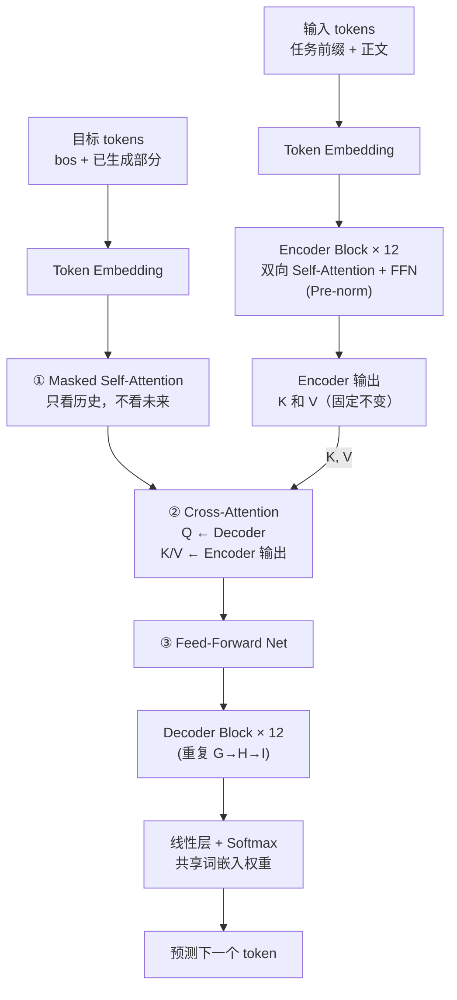

# T5：把一切 NLP 任务统一成"文本输入 → 文本输出"

> 对应论文：`paper/T5-Exploring-Limits-of-Transfer-Learning.pdf`（Raffel et al., 2020）  
> 核心问题：能不能用同一个模型、同一套训练流程，做所有 NLP 任务？

---

## 1. 背景：GPT 和 BERT 路线的共同困境

读到这里，你已经了解了两条主流路线：

- **GPT**（Decoder-Only）：擅长自回归生成，但每个下游任务需要定制不同的输出层
- **BERT**（Encoder-Only）：擅长理解任务，但天生不能做生成，做分类还需要专门的分类层

这两条路线有一个共同的麻烦：**任务格式不统一**。

做情感分类，你需要一个分类头，输出标签 0 或 1；做机器翻译，你需要一个序列生成器；做问答，你需要预测起止位置的指针……每个任务都有自己的输出格式和不同的损失函数。这带来了一个实际问题：当你想在同一套实验里比较十几种预训练方法时，**任务之间的格式差异会引入混淆变量**，你很难说清楚到底是预训练方法好，还是某个下游任务的头设计得好。

T5 的解法非常直接：**把所有任务的输出统一成"文本"**。

不管是翻译、摘要、分类、问答，还是语法判断，一律都输出一段文字。这样就能用同一个模型、同一个损失函数（交叉熵）、同一套解码策略来处理所有任务。这个框架就是论文的核心贡献——**Text-to-Text（文本到文本）**。

T5 这个名字本身就是这个框架的缩写：**T**ext-**t**o-**T**ext **T**ransfer **T**ransformer。

---

## 2. Text-to-Text 框架：用任务前缀切换"工作模式"

### 2.1 核心思想

可以把 T5 理解成一个可以根据任务前缀切换工作模式的翻译器。你告诉它"你现在要做什么任务"，然后给它输入文本，它就输出对应的文本结果。

"告诉它任务"的方式很简单：在输入文本前面加一个**任务前缀（task prefix）**。模型在预训练和微调时见过各种前缀，就能根据前缀识别任务类型。

### 2.2 几个任务的输入/输出格式

以下是论文 Figure 1 中展示的真实例子：

| 任务 | Encoder 输入 | Decoder 输出 |
|:---|:---|:---|
| 英译德 | `translate English to German: That is good.` | `Das ist gut.` |
| 语法判断（CoLA） | `cola sentence: The course is jumping well.` | `not acceptable` |
| 语义相似度（STSB） | `stsb sentence1: The rhino grazed on the grass. sentence2: A rhino is grazing in a field.` | `3.8` |
| 摘要生成 | `summarize: state authorities dispatched emergency crews tuesday...` | `six people hospitalized after a storm in attala county.` |

注意：就连数值输出（如相似度分数 `3.8`）也是以文本字符串形式生成的。模型不需要知道"这是回归任务"，它只需要生成那几个数字字符。

### 2.3 任务前缀是超参数，但不太敏感

论文里提到，任务前缀的具体措辞是一个超参数。作者测试过换不同的前缀描述（比如把 `translate English to German:` 改成别的写法），发现性能变化不大——模型并不是死记硬背了某个特定字符串，而是真正学到了前缀所代表的任务语义。

### 2.4 统一框架的好处

| 好处 | 说明 |
|:---|:---|
| 同一损失函数 | 所有任务都用交叉熵，不需要为不同任务设计不同目标 |
| 同一解码策略 | 都用 beam search 或贪心解码，不需要任务特定解码器 |
| 公平对比 | 不同预训练方法在完全相同的框架下比较，排除了任务头设计的干扰 |
| 多任务扩展自然 | 只需加新的任务前缀数据，不需要改模型结构 |

---

## 3. 架构：标准 Encoder-Decoder Transformer

### 3.1 为什么选 Encoder-Decoder，而不是 Decoder-Only 或 Encoder-Only

T5 的论文做了系统的架构对比实验（Section 3.2），比较了三种配置：

| 架构 | 代表模型 | Attention 类型 | 适合任务 |
|:---|:---|:---|:---|
| Encoder-Only | BERT | 双向 Self-Attention | 理解、分类 |
| Decoder-Only | GPT | Causal Masked Self-Attention | 生成 |
| **Encoder-Decoder** | **T5** | **Encoder 双向 + Decoder 因果 + Cross-Attention** | **生成 + 理解（通吃）** |

对于 Text-to-Text 这个目标来说，Encoder-Decoder 是最自然的选择：Encoder 充分理解输入，Decoder 生成输出文本。

### 3.2 T5-Base 的具体参数

T5-Base 与 Vaswani 2017 版 Transformer 的结构几乎一致，具体配置如下：

| 超参数 | 值 |
|:---|:---|
| Encoder 层数 | 12 |
| Decoder 层数 | 12 |
| 隐藏维度 $d_{\text{model}}$ | 768 |
| 注意力头数 | 12 |
| 每头维度 $d_{kv}$ | 64 |
| FFN 内部维度 $d_{ff}$ | 3072 |
| 总参数量 | 约 220M |

220M 大约是 BERT-Base（110M）的两倍，因为 T5 同时有 Encoder 和 Decoder 两个栈。

### 3.3 T5 与原始 Transformer 的三处关键差异

T5 相比 Vaswani 2017 做了三个改动，都值得记住：

**① Pre-norm：Layer Norm 移到残差路径外**

原始 Transformer 是 Post-norm，先做子层计算，再做 Layer Norm：

$$
x \leftarrow \text{LayerNorm}(x + \text{SubLayer}(x))
$$

T5 改成 Pre-norm，先对输入做 Layer Norm，再送入子层，Layer Norm 不在残差路径上：

$$
x \leftarrow x + \text{SubLayer}(\text{LayerNorm}(x))
$$

Pre-norm 在训练深层网络时梯度更稳定，后来成为 LLaMA 等模型的标配。

**② 去掉 Layer Norm 的 bias 项**

标准 Layer Norm 有可学习的缩放参数 $\gamma$ 和偏置参数 $\beta$。T5 去掉了 $\beta$，只保留 $\gamma$（仅做重缩放，不平移）。参数量略微减少，实践中影响不大。

**③ 相对位置偏置（第 4 节详细介绍，这是最重要的改动）**

### 3.4 Cross-Attention：Encoder 和 Decoder 的桥梁

Decoder 的每个 Block 里有三个子层：

1. **Masked Self-Attention**：Decoder 的当前状态对自身历史 token 的注意力，加因果掩码，不能偷看未来
2. **Cross-Attention**：让 Decoder 去"查询" Encoder 的输出
3. **Feed-Forward Network**

Cross-Attention 的公式和普通注意力相同：

$$
\text{CrossAttention}(Q, K, V) = \text{softmax}\!\left(\frac{QK^\top}{\sqrt{d_k}}\right) V
$$

关键在于 Q、K、V 的来源：

| 矩阵 | 来源 | 含义 |
|:---|:---|:---|
| $Q$（Query） | **Decoder** 当前层的表示 | "我正在生成的位置，需要什么信息" |
| $K$（Key） | **Encoder** 的最终输出 | "输入序列各位置可供检索的特征" |
| $V$（Value） | **Encoder** 的最终输出 | "输入序列各位置实际携带的信息" |

这个机制使 Decoder 在生成每个 token 时，都可以动态地"回看"整个输入序列，决定当前最应该参考哪些输入部分。Encoder 的输出在整个生成过程中保持不变，K 和 V 的计算只做一次。

### 3.5 T5 Encoder-Decoder 数据流图



### 3.6 完整模块伪代码

```python
import math
import torch
import torch.nn as nn

def scaled_dot_product_attention(q, k, v, mask=None):
    d_k = q.size(-1)
    # 计算相关性分数并缩放，防止大维度下 softmax 梯度消失
    scores = torch.matmul(q, k.transpose(-2, -1)) / math.sqrt(d_k)
    if mask is not None:
        scores = scores + mask      # -inf 位置在 softmax 后会变为 0
    weights = scores.softmax(dim=-1)
    return torch.matmul(weights, v)


def t5_encoder_block(x, position_bias):
    # Pre-norm：先归一化，再做 Self-Attention，最后残差相加
    x = x + multi_head_self_attention(
        layer_norm(x),
        position_bias=position_bias   # 相对位置偏置加到 attention logit 上
    )
    # Pre-norm FFN
    x = x + feed_forward(layer_norm(x))
    return x


def t5_decoder_block(x, encoder_output, enc_position_bias=None, dec_position_bias=None):
    # ① Masked Self-Attention：只能看历史，加因果掩码
    x = x + masked_self_attention(
        layer_norm(x),
        causal_mask=True,
        position_bias=dec_position_bias
    )
    # ② Cross-Attention：Q 来自 Decoder，K/V 来自 Encoder 输出
    x = x + cross_attention(
        query=layer_norm(x),          # Q：Decoder 当前状态
        key=encoder_output,           # K：Encoder 的记忆
        value=encoder_output          # V：Encoder 的记忆
    )
    # ③ FFN
    x = x + feed_forward(layer_norm(x))
    return x


def t5_forward(input_ids, target_ids):
    # Encoder：双向处理输入，生成上下文记忆
    enc = token_embedding(input_ids)
    for _ in range(12):
        enc = t5_encoder_block(enc, encoder_position_bias)

    # Decoder：以 Encoder 输出为记忆，自回归生成目标序列
    dec = token_embedding(target_ids)
    for _ in range(12):
        dec = t5_decoder_block(dec, enc, dec_position_bias=decoder_position_bias)

    # 输出层权重与词嵌入矩阵共享（tied embeddings）
    logits = dec @ token_embedding.weight.T
    return logits
```

---

## 4. 相对位置偏置：T5 的位置编码方案

### 4.1 为什么不用绝对位置编码

在 Transformer.md 里你见过原始论文的正弦余弦位置编码——把位置向量加到词嵌入上，位置信息被混进了词义表示里。BERT 和 GPT 用的是可学习的绝对位置嵌入，同样有这个问题，并且有严格的长度上限（BERT 是 512）。

绝对位置编码的根本局限是：**模型学到的是"第 5 个位置"这件事，而不是"两个词相距 3 步"这件事**。推理时如果出现训练时没见过的序列长度，行为就难以预测。

T5 选择了一种更灵活的方案：**相对位置偏置（Relative Position Bias）**——不把位置信息加到词嵌入上，而是直接把一个标量偏置加到注意力 logit 上。

### 4.2 相对位置偏置的工作方式

回顾注意力分数的计算，T5 在原始 logit 上直接加一个标量 $b$：

$$
\text{attention logit}_{mn} = \frac{q_m \cdot k_n}{\sqrt{d_k}} + b\!\left(\text{clip}(|m - n|,\; \max=128)\right)
$$

其中：
- $m$ 是 Query 的位置，$n$ 是 Key 的位置
- $|m - n|$ 是两个位置之间的相对偏移（offset）
- $\text{clip}(\cdot, \max=128)$ 把超过 128 的 offset 全部截断到 128
- $b(\cdot)$ 是一个可学习的查找表，根据 offset 返回对应的标量偏置

这个设计的直觉是：**两个位置之间的关系，主要取决于它们相距多远，而不是各自的绝对位置**。"第 3 个词看第 5 个词"和"第 103 个词看第 105 个词"，位置关系相同（offset=2），应该使用相同的偏置。

### 4.3 32 个 Embedding + 对数分桶

T5 用 **32 个可学习的 embedding** 来表示所有可能的 offset。但位置 offset 理论上可以从 0 到无穷大，32 个 embedding 怎么够用？

答案是**对数分桶（logarithmic bucketing）**：

- offset 较小时（0 到约 16），每个整数 offset 对应一个独立的 bucket（精细区分）
- offset 较大时，把一段范围内的 offset 合并到同一个 bucket（对数间距，粗粒度处理）
- 超过 128 的 offset，全部归到同一个 bucket（远距离统一对待）

这样的设计符合语言的直觉：相邻词之间的位置关系很重要（需要精细区分），距离很远的词位置关系影响已经很小（粗粒度也够用）。

### 4.4 参数在层间共享，但同层不同头独立

相对位置偏置的参数设计有两条规则：

- **层间共享**：所有 12 层 Encoder Block 共享同一套 32 个 embedding（节省参数，有正则化效果）
- **头间独立**：同一层的 12 个注意力头各有自己的 32 个 embedding（每个头可以学到不同的位置敏感模式）

所以 Encoder 端总计是 $12 \text{ 头} \times 32 \text{ bucket} = 384$ 个可学习标量，参数量极小。

对数分桶的代码实现：

```python
import math
import torch
import torch.nn as nn

class RelativePositionBias(nn.Module):
    def __init__(self, n_heads, n_buckets=32, max_distance=128):
        super().__init__()
        self.n_buckets = n_buckets
        self.max_distance = max_distance
        # 每个 head 有一组偏置标量，形状：(n_buckets, n_heads)
        self.embedding = nn.Embedding(n_buckets, n_heads)

    def _position_to_bucket(self, relative_position):
        """把相对位置偏移映射到 bucket 编号：近距离精细，远距离合并。"""
        n = -relative_position          # 处理因果方向（Decoder 只看历史）
        n = torch.clamp(n, min=0)

        max_exact = self.n_buckets // 2   # 前一半 bucket：线性覆盖近距离
        is_small = n < max_exact

        # 后一半 bucket：对数间距稀疏覆盖远距离
        val_if_large = max_exact + (
            torch.log(n.float() / max_exact)
            / math.log(self.max_distance / max_exact)
            * (self.n_buckets - max_exact)
        ).long().clamp(max=self.n_buckets - 1)

        return torch.where(is_small, n, val_if_large)

    def forward(self, seq_len_q, seq_len_k, device):
        # 构建 (seq_len_q, seq_len_k) 的相对位置矩阵
        q_pos = torch.arange(seq_len_q, device=device).unsqueeze(1)   # (T_q, 1)
        k_pos = torch.arange(seq_len_k, device=device).unsqueeze(0)   # (1, T_k)
        relative_position = k_pos - q_pos                              # (T_q, T_k)

        bucket_ids = self._position_to_bucket(relative_position)      # (T_q, T_k)

        # 查表得到偏置 (T_q, T_k, n_heads)，转置为 (n_heads, T_q, T_k) 加到 logit 上
        bias = self.embedding(bucket_ids).permute(2, 0, 1)
        return bias
```

### 4.5 与 RoPE 的对比

如果你读过 LLaMA.md，会知道 RoPE（旋转位置编码）也是一种处理相对位置的方案。两者的区别：

| | T5 相对位置偏置 | RoPE |
|:---|:---|:---|
| 作用位置 | 直接加到 attention logit（标量偏置） | 旋转 Q/K 向量（向量操作） |
| 位置表示 | 可学习的查找表（少量参数） | 固定的旋转矩阵（无参数） |
| 外推能力 | 超过 128 截断，外推能力有限 | 理论上可以外推到更长序列 |
| 层间关系 | 层间共享参数 | 层间独立（各层使用相同公式但不共享） |

T5 的偏置是加在注意力分数矩阵上的一个**标量**，而 RoPE 是通过旋转操作改变 Q 和 K 向量本身，两者在数学形式上是不同路径解决同一问题。

---

## 5. C4 数据集：从互联网噪声到 750GB 干净文本

### 5.1 为什么需要新数据集

Common Crawl 每月爬取约 20TB 的网页文本，理论上是无限量的预训练数据来源。但原始网页数据充满噪声：广告、乱码、JavaScript 代码、重复内容……直接拿来训练效果很差。

T5 论文的一个重要贡献是建立了 **C4（Colossal Clean Crawled Corpus）**，一个经过系统清洗的 Common Crawl 子集，约 750GB 干净英文文本。

### 5.2 清洗流程

从原始 Common Crawl 到 C4，经过了以下过滤步骤：

| 步骤 | 规则 | 目的 |
|:---|:---|:---|
| 保留完整句子 | 只保留以标点（`.` `?` `!`）结尾的行 | 过滤碎片文本和标题党 |
| 去除短页面 | 删除句子数少于 3 的页面 | 过滤低质量短文本 |
| 去重 | 删除在任意三句话连续片段中重复出现的内容 | 减少重复数据 |
| 过滤脏词 | 使用脏词列表，删除含有不雅内容的页面 | 过滤有害内容 |
| 过滤占位符 | 删除包含 "lorem ipsum" 的页面 | 过滤模板占位文本 |
| 过滤代码 | 删除包含花括号 `{` 的页面 | 保持自然语言为主 |
| 语言过滤 | 用 langdetect 保留英语概率 $\geq 0.99$ 的页面 | 专注英语 |

清洗结果：原始 Common Crawl 约 20TB → C4 约 750GB，过滤掉了约 96% 的原始数据。质量而非数量是 C4 设计的核心原则。

---

## 6. 预训练目标：Span Corruption

### 6.1 BERT 的 MLM 有什么局限

BERT 的预训练目标是 MLM（Masked Language Model）：随机遮盖 15% 的 token，让 Encoder 预测被遮盖的词。

这个设计有一个效率问题：**每个训练步只有 15% 的 token 贡献梯度，其余 85% 的 token 是已知的上下文**。在 Encoder-Decoder 框架里，如果 Decoder 每次只生成零散的几个词，大量计算资源浪费在了"处理已知内容"上。

T5 的解法是把遮盖单位从"单个 token"升级为"连续的 token 段"。

### 6.2 Span Corruption：遮盖连续段落

**Span Corruption（段落破坏）** 的做法：

1. 从输入中随机选取若干个连续 token 段（span），每个 span 的平均长度为 3 个 token
2. 把每个 span 替换成一个**哨兵 token（sentinel token）**，如 `<extra_id_0>`、`<extra_id_1>`……
3. Decoder 的目标输出是所有被替换 span 的原始内容，同样用哨兵 token 分隔

具体例子（来自论文 Section 3.3）：

```
原始文本：
  Thank you for inviting me to your party last week.

Encoder 输入（span 被哨兵替换）：
  Thank you <X> me to your party <Y> week.
             ↑                   ↑
       span1 → <X>         span2 → <Y>

Decoder 目标输出：
  <X> for inviting <Y> last <Z>
  ↑                ↑        ↑
span1 内容    span2 内容   终止哨兵
```

### 6.3 为什么 Span Corruption 更高效

| | BERT MLM | T5 Span Corruption |
|:---|:---|:---|
| 遮盖单位 | 单个 token | 连续 span（平均 3 token） |
| 遮盖比例 | 15% token | 15% token（效果相当） |
| Decoder 目标 | 所有 token（含未遮盖的） | **只有被遮盖的 span** |
| Decoder 输出长度 | — | 远短于输入（仅被遮盖部分） |
| 计算效率 | 低（大量无意义预测） | **高**（每步都在生成有信息量的内容） |

关键优势：**Decoder 的输出序列比输入序列短很多**，只包含被遮盖的部分，训练时每一步计算都在产生有效的梯度信号，没有浪费。

### 6.4 代码示意

```python
def span_corruption(tokens, noise_density=0.15, mean_span_length=3):
    """
    将输入 token 序列随机破坏若干 span，返回 encoder 输入和 decoder 目标。
    噪声比例约为 15%，每个 span 平均长度为 3 token。
    """
    num_noise_tokens = int(len(tokens) * noise_density)
    num_spans = max(1, num_noise_tokens // mean_span_length)

    # 随机采样若干 span 的起止位置（简化实现，实际用泊松分布采样长度）
    spans = sample_non_overlapping_spans(len(tokens), num_spans, mean_span_length)

    encoder_input = []
    decoder_target = []
    sentinel_id = 0
    prev_end = 0

    for start, end in sorted(spans):
        # 未被遮盖的部分直接放入 encoder 输入
        encoder_input.extend(tokens[prev_end:start])
        # 用哨兵 token 替换被遮盖的 span
        encoder_input.append(f"<extra_id_{sentinel_id}>")
        # decoder 目标：哨兵 token + span 的原始内容
        decoder_target.append(f"<extra_id_{sentinel_id}>")
        decoder_target.extend(tokens[start:end])
        sentinel_id += 1
        prev_end = end

    # 剩余未遮盖的部分追加到 encoder 输入
    encoder_input.extend(tokens[prev_end:])
    # 终止哨兵：告诉 decoder 所有 span 已还原完毕
    decoder_target.append(f"<extra_id_{sentinel_id}>")

    return encoder_input, decoder_target
```

---

## 7. 训练细节

### 7.1 优化器：AdaFactor

T5 使用 **AdaFactor** 而不是 Adam。AdaFactor 的核心改进是用矩阵的行/列统计量近似二阶矩，大幅减少优化器状态的显存占用——对于 11B 参数的模型来说，这是关键的工程选择。

### 7.2 预训练超参数

| 超参数 | 值 |
|:---|:---|
| 预训练步数 | $2^{19} = 524{,}288$ 步 |
| Batch size | 128 sequences × 512 tokens = 65,536 tokens/batch（约 $2^{16}$ tokens） |
| 总预训练 tokens | $2^{35} \approx 34\text{B}$ tokens |
| 学习率调度 | Inverse square root：$\text{lr} = 1/\sqrt{\max(n,\, k)}$，$k=10^4$ 步预热 |
| 微调步数 | $2^{18} = 262{,}144$ 步 |
| 微调学习率 | 常数 $0.001$ |

值得注意的是，T5 的预训练数据量（约 34B tokens）远少于 BERT（137B tokens）和 RoBERTa（2.2T tokens）。这是有意为之——论文的目标是系统比较预训练方法，而不是追求最大规模。

### 7.3 与 BERT 训练规模对比

| | BERT-Base | T5-Base | T5-11B |
|:---|:---|:---|:---|
| 参数量 | 110M | 220M | 11B |
| 预训练 tokens | 137B | 34B | 34B |
| 优化器 | Adam | AdaFactor | AdaFactor |
| 位置编码 | 可学习绝对 PE | 相对位置偏置 | 相对位置偏置 |

---

## 8. 模型规模系列

T5 不是一个单一模型，而是一个模型家族：

| 模型 | Encoder/Decoder 层数 | $d_{\text{model}}$ | 注意力头数 | 参数量 |
|:---|:---|:---|:---|:---|
| T5-Small | 6 / 6 | 512 | 8 | 60M |
| T5-Base | 12 / 12 | 768 | 12 | 220M |
| T5-Large | 24 / 24 | 1024 | 16 | 770M |
| T5-3B | 24 / 24 | 1024 | 32 | 3B |
| T5-11B | 24 / 24 | 1024 | 128 | 11B |

论文的规模实验（Section 3.6 / 3.7）的主要结论：

- **更大的模型**：在所有任务上都有持续的性能提升，没有明显的性能瓶颈
- **更多数据**：用完整 C4 比用 C4 子集效果更好；用多样化数据比重复使用少量数据好
- **更长训练**：在相同数据量下，增加训练步数有帮助，但收益递减
- **三者结合**：T5-11B 在多个基准测试（SuperGLUE、CNN/DailyMail、SQuAD 等）上达到当时的最佳效果

---

## 9. 三大路线横向对比

| | BERT | GPT-2 | T5 |
|:---|:---:|:---:|:---:|
| 架构 | Encoder-Only | Decoder-Only | **Encoder-Decoder** |
| 预训练目标 | MLM（完形填空） | CLM（预测下一词） | **Span Corruption** |
| 位置编码 | 可学习绝对位置嵌入 | 可学习绝对位置嵌入 | **相对位置偏置** |
| 适用任务类型 | 理解/分类 | 生成 | **生成 + 理解（通吃）** |
| 输出格式 | 任务头（分类/指针） | 文本续写 | **统一文本输出** |
| 最大规模 | 340M（Large） | 1.5B | **11B** |

---

## 10. 常见混淆问题

**Q：T5 的 Encoder 和 BERT 的 Encoder 有什么本质区别？**

BERT 的 Encoder 是整个模型——它的最终输出直接用于下游任务，需要在 `[CLS]` 或各 token 位置加分类头。T5 的 Encoder 是 Encoder-Decoder 结构的前半段——它的输出只是"上下文记忆"，供 Decoder 通过 Cross-Attention 使用，最终的答案由 Decoder 以文本形式生成。

**Q：Span Corruption 中的哨兵 token 是普通词表中的词吗？**

不是普通词。T5 在词表中专门预留了 100 个特殊 token `<extra_id_0>` 到 `<extra_id_99>`，只用于预训练时的哨兵标记。微调时这些 token 一般不会出现在输入中。

**Q：T5 的相对位置偏置在推理时能外推到超过 128 的长度吗？**

能推理，但超过 128 的 token 之间的位置偏置会被截断到同一个 bucket（对应 offset=128 的 embedding），位置区分能力下降。这是 T5 相对位置方案的局限，也是后来 RoPE、ALiBi 等方案被提出的动机之一。

**Q：T5 的输出层参数和词嵌入层共享吗？**

是的。T5 的最终输出线性层（把隐藏向量映射到词表概率）与输入词嵌入矩阵共享权重（tied embeddings），这是常见的参数共享技巧，能减少参数量并有轻微的正则化效果。

**Q：任务前缀是特殊 token 还是普通文本？**

是普通文本，不是特殊 token。`translate English to German:` 这些词都来自正常词表。模型通过语言理解任务意图，而不依赖人工标记的 task ID。这也是 T5 框架优雅的地方——它不需要改动词表或架构就能扩展到新任务。

---

## 11. 完整流程一句话总结

> T5 把所有 NLP 任务用**任务前缀**统一成文本输入，送入 12 层 **Encoder**（用**相对位置偏置**编码位置关系）得到上下文记忆，再由 12 层 **Decoder** 通过 **Cross-Attention** 查询这段记忆、自回归地生成输出文本；在 **C4** 数据集上用 **Span Corruption** 目标预训练，然后在各任务上统一微调。

---

## 12. 读完这篇之后，你应该能回答这些问题

- Text-to-Text 框架的核心思想是什么？为什么把任务统一成文本输出有助于公平比较不同预训练方法？
- T5 为什么选择 Encoder-Decoder 架构，而不是 Decoder-Only 或 Encoder-Only？
- Cross-Attention 中 $Q$、$K$、$V$ 分别来自哪里？它在 Encoder 和 Decoder 之间扮演什么角色？
- T5 的相对位置偏置是如何工作的？为什么用对数分桶而不是每个 offset 对应一个独立的 embedding？为什么层间共享但头间独立？
- Span Corruption 相比 BERT 的 MLM 有什么优势？哨兵 token 机制解决了什么问题？
- C4 数据集是如何从 Common Crawl 清洗得到的？主要过滤了哪些类型的噪声？
- T5-11B 相比 T5-Base 的性能提升说明了什么？规模、数据量、训练时长三者的关系是什么？
- Pre-norm 和 Post-norm 有什么区别？T5 为什么选择 Pre-norm？

---

## 参考资料

- 原始论文：`paper/T5-Exploring-Limits-of-Transfer-Learning.pdf`（Raffel et al., 2020）
- 论文链接：https://arxiv.org/abs/1910.10683
- 代码仓库：https://github.com/google-research/text-to-text-transfer-transformer
- 相关文章：`Attention/Transformer.md`、`Attention/BERT.md`、`Attention/GPT.md`、`Attention/LLaMA.md`（RoPE 对比）
